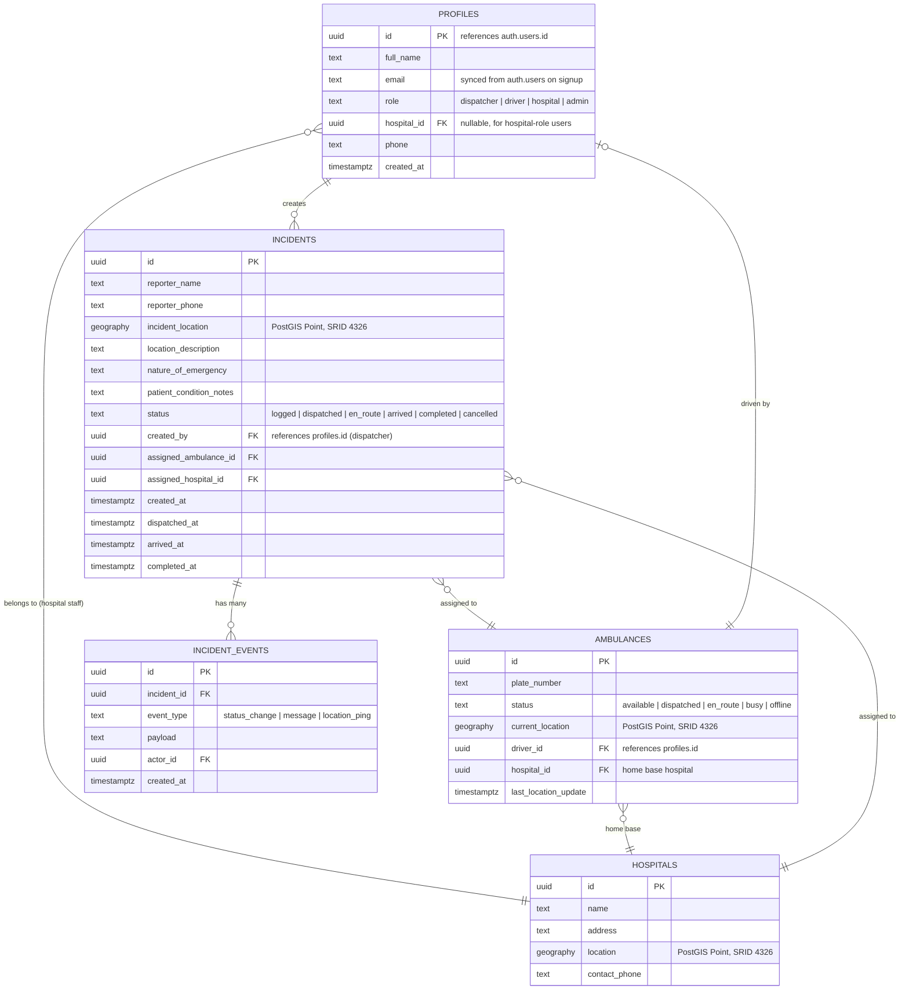
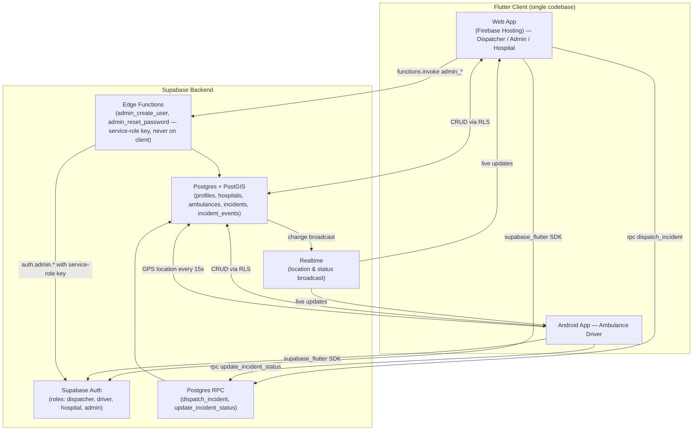
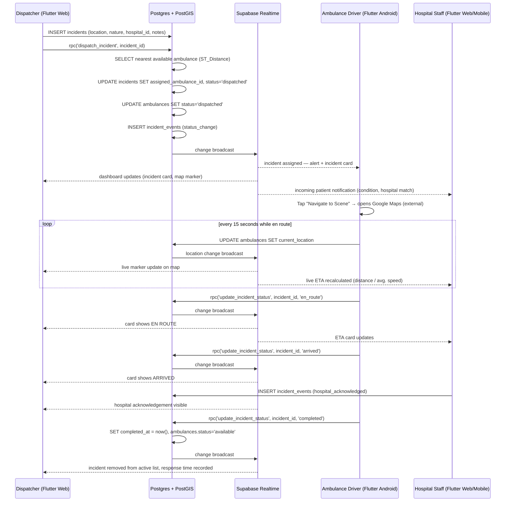

# EMERGENCY RESPONSE AND AMBULANCE MANAGEMENT SYSTEM (ERAMS)

**System Documentation**

**Project:** Final Year Project, Department of Computer Science, Kyambogo University
**Team:** Ashaba Ritah, Ochiria Elias Onyait, Katusiime Eugene, Ashaka Joseph
**Supervisor:** Ms. Shallon Ahimbisibwe

> For implementation-level detail (exact tech stack rationale, build phases, repo structure) see [`ERAMS_TECHNICAL_BUILD_PLAN.md`](ERAMS_TECHNICAL_BUILD_PLAN.md). For live build progress and outstanding QA items, see [`COMPLETED_WORK.md`](COMPLETED_WORK.md). This document is the descriptive system report (analysis, design, and implementation summary).

---

## 1.0 Introduction

The Emergency Response and Ambulance Management System (ERAMS) is a digital platform designed to improve the efficiency of emergency medical response services in Uganda. The system reduces delays in ambulance dispatch, improves communication between dispatchers, drivers, and hospitals, and ensures timely medical assistance through real-time tracking and automated nearest-ambulance assignment.

### 1.1 Problem Statement

Traditional emergency response at the case study sites (Healthstone Hospital, Banda, and Mulago National Referral Hospital) relies heavily on manual communication — telephone calls and paper or DHIS2 logbooks. This leads to delayed response times (often exceeding one hour at Mulago), miscommunication, no real-time visibility into ambulance location or availability, and no structured record of incident outcomes for performance review.

### 1.2 Purpose of the System

The purpose of ERAMS is to automate and streamline emergency request handling, ambulance dispatching, and inter-facility communication through a centralized, role-based, real-time platform that works across web and mobile devices.

---

## 2.0 System Analysis

### 2.1 Existing System

Currently, emergency services at the case study sites depend on:

- Phone calls / a toll-free line to request ambulances
- Manual or DHIS2-based recording of patient and incident details
- No real-time ambulance location tracking
- No automated matching of the nearest available ambulance to an incident

### 2.2 Limitations of Existing System

- Delayed response time — no way to identify the geographically closest available ambulance
- Human errors in communication between dispatcher, driver, and hospital
- No centralized system for request tracking or incident history
- Poor coordination between hospitals and ambulance drivers; hospitals receive little to no advance notice of an incoming patient's condition or ETA
- Vulnerability to power and network outages, with no offline fallback
- No role-based access control or audit trail of who handled what

### 2.3 Proposed System

ERAMS introduces a centralized, role-based system where:

- Dispatchers can log an emergency call with location, nature of emergency, and patient notes, and dispatch the nearest available ambulance automatically (PostGIS geospatial query) or manually
- Ambulance drivers receive dispatch alerts in real time, share live GPS location, advance the incident through status stages, and get a one-tap "Navigate to Scene" link into Google Maps
- Hospital staff see incoming patients with a live ETA and can acknowledge readiness to receive
- Administrators manage the ambulance fleet, manage user accounts (including creating new accounts and resetting passwords), and view response-time analytics

---

## 3.0 System Requirements

### 3.1 Functional Requirements

The system shall:

- Allow user authentication with four distinct roles: **Dispatcher**, **Ambulance Driver**, **Hospital Staff**, **Administrator** — each redirected to a role-specific dashboard on login
- Allow dispatchers to log an emergency incident (location pin on a map, nature of emergency, reporter details, patient condition notes, target hospital)
- Automatically assign the nearest available ambulance to an incident using geospatial distance (PostGIS `ST_Distance`), with a manual override/assignment dialog when no ambulance is available
- Allow ambulance drivers to toggle their status (Available / Busy / Offline), receive a real-time alert when dispatched, advance an incident through its lifecycle (Dispatched → En Route → Arrived → Completed), and open turn-by-turn navigation to the incident location in Google Maps
- Continuously broadcast the driver's live GPS location to the dispatcher's map and the receiving hospital's ETA display while an incident is active
- Allow hospital staff to view incidents assigned to their hospital with a live, distance-based ETA, and acknowledge readiness to receive the patient (persisted, not lost on refresh)
- Allow administrators to manage the ambulance fleet (add/edit ambulances, assign drivers and home hospitals), manage user accounts (create new accounts, edit name/phone, change role, reset a forgotten/compromised password), and view analytics (incident counts by status and by hospital, average response time)
- Force any user with a newly created or admin-reset password to set their own password before reaching their dashboard
- Provide each role with a profile view and a history tab of their own past incidents
- Provide status, incident, and location updates in real time without requiring a manual page refresh

### 3.2 Non-Functional Requirements

The system shall ensure:

- **Security** — authentication via Supabase Auth; every table protected by row-level security (RLS) policies scoped to role and ownership; no privileged credentials (service-role key) ever shipped to the client — privileged operations (user creation, password reset) run server-side in Supabase Edge Functions
- **Real-time responsiveness** — incident, ambulance, and status changes propagate to all relevant roles via Supabase Realtime, typically within a few seconds
- **Reliability and availability** — backed by Supabase's managed Postgres and Firebase Hosting's CDN; failed driver location pushes are queued in memory and retried on reconnect
- **Cross-platform usability** — a single Flutter codebase serves the web (dispatcher/admin desktop use) and Android (driver mobile use) from one source tree
- **Usability** — role-appropriate, responsive layouts (desktop-oriented for dispatcher/admin, mobile-oriented for driver/hospital)

---

## 4.0 System Design

### 4.1 System Overview

The system consists of:

- **Client** — a single Flutter codebase (web + Android), using Riverpod for state management and `go_router` for role-based navigation
- **Backend** — Supabase: Postgres database with the PostGIS extension, Auth, Realtime (websocket change broadcast), and Edge Functions for privileged server-side logic
- **Hosting** — Firebase Hosting serves the compiled static Flutter web build; Firebase performs no application logic

### 4.2 Use Case Description

Actors:

- **Dispatcher** — logs incidents, dispatches ambulances, monitors the live map and fleet
- **Ambulance Driver** — receives dispatch alerts, shares live location, updates incident status, navigates to the scene
- **Hospital Staff** — views incoming patients, monitors ETA, acknowledges incoming patients
- **Administrator** — manages the ambulance fleet, manages user accounts, views analytics

Main interactions:

- Log incident → Dispatch ambulance (auto or manual) → Driver alerted → Driver navigates and updates status → Hospital notified with live ETA → Hospital acknowledges → Incident completed → Recorded in history and analytics

### 4.3 Data Model (ERD)

The ERAMS database is a relational model implemented in Supabase PostgreSQL with the PostGIS extension. It stores users, hospitals, ambulances, incidents, and incident events. PostGIS `geography(Point, 4326)` columns support real-time location tracking and nearest-ambulance geospatial queries.



#### Entity Descriptions

**1. PROFILES** — every system user (one row per `auth.users` entry, auto-created by a Postgres trigger on signup).

| Attribute | Description |
| --- | --- |
| id | Unique identifier for each user (matches `auth.users.id`) |
| full_name | User's full name |
| email | User's sign-in email, kept in sync from `auth.users` |
| role | dispatcher \| driver \| hospital \| admin |
| hospital_id | Associated hospital (hospital-role users only) |
| phone | Contact number |
| created_at | Account creation timestamp |

**2. HOSPITALS** — registered hospitals.

| Attribute | Description |
| --- | --- |
| id | Hospital identifier |
| name | Hospital name |
| address | Physical address |
| location | GPS coordinates (PostGIS geography) |
| contact_phone | Hospital contact number |

**3. AMBULANCES** — fleet vehicles and their live tracking state.

| Attribute | Description |
| --- | --- |
| id | Ambulance identifier |
| plate_number | Registration number |
| status | available \| dispatched \| en_route \| busy \| offline |
| current_location | Live GPS location (PostGIS geography), updated by the driver app |
| driver_id | Assigned driver |
| hospital_id | Home base hospital |
| last_location_update | Timestamp of the last GPS push |

**4. INCIDENTS** — emergency reports logged by dispatchers.

| Attribute | Description |
| --- | --- |
| id | Incident identifier |
| reporter_name / reporter_phone | Person reporting the emergency |
| incident_location | Emergency location (PostGIS geography) |
| location_description | Free-text location detail |
| nature_of_emergency | Type of emergency |
| patient_condition_notes | Patient condition information |
| status | logged \| dispatched \| en_route \| arrived \| completed \| cancelled |
| created_by | Dispatcher who created the record |
| assigned_ambulance_id | Ambulance assigned by dispatch |
| assigned_hospital_id | Receiving hospital |
| created_at / dispatched_at / arrived_at / completed_at | Lifecycle timestamps, used to compute response time |

**5. INCIDENT_EVENTS** — append-only audit log of activity on an incident (status changes, hospital acknowledgements, location pings).

| Attribute | Description |
| --- | --- |
| id | Event identifier |
| incident_id | Related incident |
| event_type | status_change \| message \| location_ping |
| payload | Event details (free text / JSON) |
| actor_id | User who performed the action |
| created_at | Event timestamp |

#### Relationships

1. A hospital can have many staff profiles.
2. A hospital can have many ambulances (home base).
3. One ambulance is assigned to at most one driver.
4. An incident is assigned to at most one ambulance.
5. An incident is assigned to at most one hospital.
6. One incident can have many incident events.
7. One dispatcher can create many incidents.

### 4.4 System Architecture

ERAMS uses a client-heavy architecture: the Flutter client talks directly to Supabase for standard reads/writes (governed by row-level security), while operations that must be atomic, secure, or privileged are pushed server-side as Postgres functions (RPC) or Edge Functions.



### 4.5 Core Dispatch Flow (Sequence Diagram)



---

## 5.0 Database Design

### 5.1 Implementation Notes

The schema in Section 4.3 is implemented as a series of numbered SQL migration files (`supabase/migrations/`), applied in order via the Supabase CLI:

- **Schema + PostGIS** — table creation, `geography(Point, 4326)` columns, and `GIST` spatial indexes on `current_location` / `incident_location` for fast nearest-ambulance queries
- **Auth trigger** — a `SECURITY DEFINER` Postgres function inserts a `profiles` row (full name, role, phone, email) automatically whenever a new `auth.users` row is created, defaulting role to `driver` until an admin assigns the correct one
- **Row-Level Security (RLS)** — enabled on every table; no table is publicly readable or writable by default

### 5.2 RLS Policy Summary

| Role | profiles | hospitals | ambulances | incidents | incident_events |
| --- | --- | --- | --- | --- | --- |
| Dispatcher | read own; read-all via role check | read all | read all | full read/write | insert |
| Driver | read own | read all | read all; update own assigned ambulance | read/update own assigned incident | insert on own incident |
| Hospital | read own | read all | read all (for ETA) | read incidents assigned to own hospital | insert (acknowledge) on own hospital's incidents |
| Admin | full read/write | full read/write | full read/write | full read/write | full read |

Privileged operations that fall outside what RLS can safely express from the client — creating a new `auth.users` account and resetting a user's password — are implemented as Supabase **Edge Functions** (`admin_create_user`, `admin_reset_password`). Each function independently re-verifies the caller's JWT and confirms `profiles.role = 'admin'` before using the service-role key, which never leaves the server.

### 5.3 Relationship Summary

```
Hospital
 ├── Profiles (Hospital Staff)
 └── Ambulances
      └── Driver (Profile)

Dispatcher (Profile)
 └── Creates Incidents
      ├── Assigned Ambulance
      ├── Assigned Hospital
      └── Incident Events
```

---

## 6.0 System Implementation

ERAMS is implemented as a **single Flutter codebase** targeting Web (primary dispatcher/admin/hospital demo target) and Android (driver), backed by **Supabase** and deployed to **Firebase Hosting**.

| Layer | Technology |
| --- | --- |
| Client | Flutter (Dart), single codebase for Web + Android |
| State management | Riverpod (`AsyncNotifier`, `FutureProvider`) |
| Routing | `go_router`, with role-based redirect guards |
| Maps | `flutter_map` + OpenStreetMap tiles (zero-cost, no API key) |
| Driver navigation | Google Maps deep link (`url_launcher`) for turn-by-turn directions |
| GPS | `geolocator`, periodic location push every 15 seconds |
| Charts | `fl_chart` (admin analytics) |
| Offline queueing | In-memory retry queue for failed GPS pushes, flushed on reconnect |
| Backend | Supabase (Postgres + PostGIS, Auth, Realtime, Edge Functions) |
| Server-side logic | Postgres RPC (`dispatch_incident`, `update_incident_status`) + Deno Edge Functions (`admin_create_user`, `admin_reset_password`) |
| Hosting | Firebase Hosting (static web build only) |
| CI/CD | GitHub Actions — Flutter web build/deploy, Supabase migration/function deploy |

### 6.1 Features Implemented

- **Authentication & RBAC** — email/password login via Supabase Auth, role-based dashboard redirect for four roles
- **Dispatcher module** — incident logging form with map pin drop, live map (incident/ambulance/hospital markers), filterable incident dashboard, real-time updates
- **Automated dispatch** — PostGIS nearest-available-ambulance RPC with manual-assignment fallback when no ambulance is available
- **Driver module** — status toggle, real-time dispatch alerts, live GPS sharing every 15 seconds, status lifecycle controls, one-tap "Navigate to Scene" Google Maps deep link, offline GPS retry queue
- **Hospital module** — incoming-patient list filtered to the user's hospital, live distance-based ETA, "Acknowledge — Ready to Receive" action persisted to the database (survives page refresh)
- **Admin module** — fleet management (add/edit ambulances, assign drivers and home hospitals); user management (create accounts, edit name/phone, change role, reset passwords — all privileged actions routed through Edge Functions); analytics dashboard (incident counts by status/hospital, average response time)
- **Account security** — newly created or password-reset accounts are flagged `must_change_password` and are required to set their own password before reaching their dashboard
- **Profile & history** — every role has a profile view and a tab of their own incident history
- **Cross-cutting** — responsive layouts per role, real-time propagation via Supabase Realtime throughout

---

## 7.0 Testing

### 7.1 Testing Approach

ERAMS testing combines automated static analysis with structured manual QA, rather than a separate automated test suite (given the compressed two-week build window):

- **Static analysis** — `flutter analyze` is run after every development session and must report zero issues before a change is considered complete (enforced convention, see `CLAUDE.md`)
- **Manual per-phase QA** — each build phase has an explicit "Needs Team Testing" checklist in [`docs/COMPLETED_WORK.md`](COMPLETED_WORK.md), covering the specific user actions and expected outcomes the team must walk through (e.g. "dispatch nearest ambulance and confirm both records update atomically," "acknowledge a patient and confirm it survives a page refresh")
- **Cross-role, end-to-end smoke testing** — the full flow (dispatcher logs incident → auto-dispatch → driver alert → live GPS → hospital ETA → acknowledgement → completion → admin analytics) is walked through manually across simultaneous role sessions before a phase is marked verified
- **Planned end-user evaluation** — a structured evaluation form (mirroring the original proposal's Section F: ease of use, GPS accuracy, dispatch speed, communication effectiveness) is administered during Phase 8 demo walkthroughs with representative users

A task is marked `[x]` (done, awaiting team verification) and only promoted to `[✓]` (tested and verified) in `COMPLETED_WORK.md` once a team member has actually walked through its test checklist — see that document for current status per phase.

---

## 8.0 Conclusion and Recommendations

### 8.1 Conclusion

ERAMS successfully replaces the manual, phone-call-based dispatch process at the case study sites with a centralized, real-time, role-based platform. Core functionality — incident logging, automated nearest-ambulance dispatch, live driver tracking, hospital ETA notification, and administrative fleet/user/analytics management — is implemented end-to-end across the Dispatcher, Driver, Hospital, and Admin roles, addressing the response-time, coordination, and visibility gaps identified in the original stakeholder research.

### 8.2 Current Status

As of this document's last update, Phases 0–7 of the build plan (environment setup through cross-platform polish and deployment) are implemented; Phase 8 (validation, documentation, demo preparation) is in progress. See [`COMPLETED_WORK.md`](COMPLETED_WORK.md) for the authoritative, up-to-date phase-by-phase status.

### 8.3 Recommendations

- Complete team verification of all `[x]` (built but unverified) items in `COMPLETED_WORK.md` before the final demo
- Deploy the `admin_create_user` and `admin_reset_password` Edge Functions and their supporting migration to the production Supabase project before relying on admin user-management in a live demo
- Upgrade the hospital ETA calculation from a straight-line/average-speed estimate to a routing API (e.g. OSRM) if time and budget allow
- Revisit DHIS2 export as a future enhancement — deferred from the current build given the timeline, but the data model does not preclude it
- Consider SMS notifications as a fallback channel for users without reliable data connectivity, per the original proposal's stretch goals

---

*Last updated alongside the Phase 6 admin user-management work (create user, edit details, reset password with forced password change). See `ERAMS_TECHNICAL_BUILD_PLAN.md` for the living technical reference and `COMPLETED_WORK.md` for current build/test status.*
