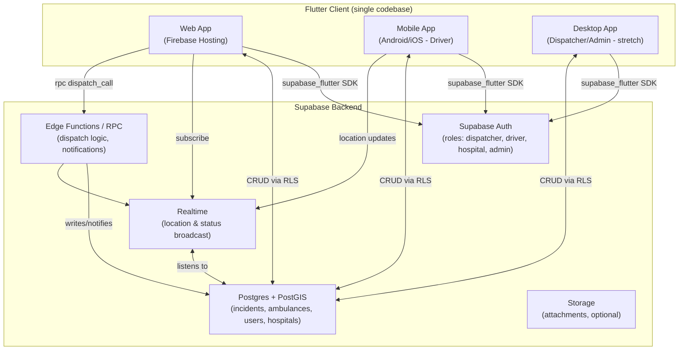
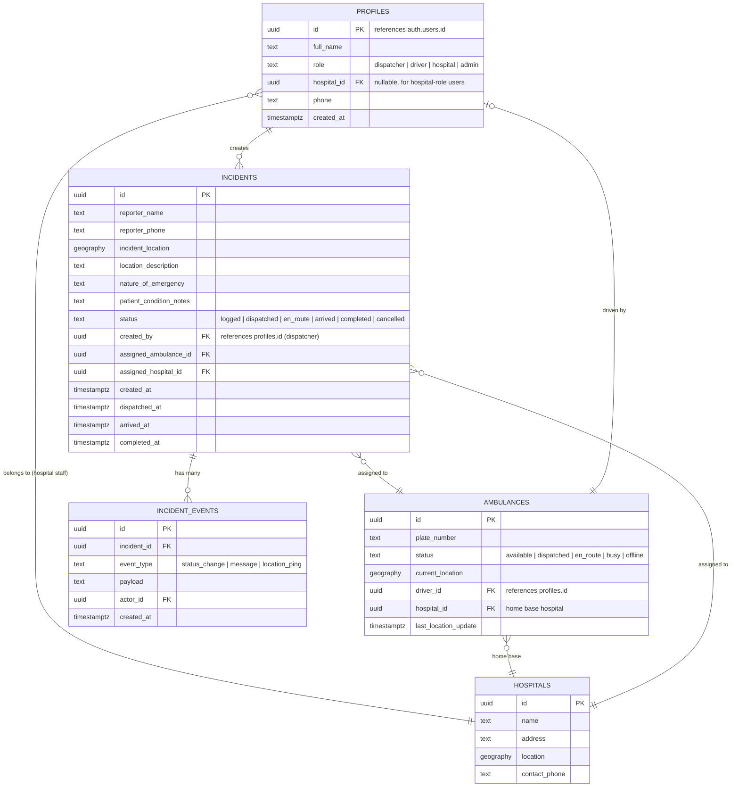
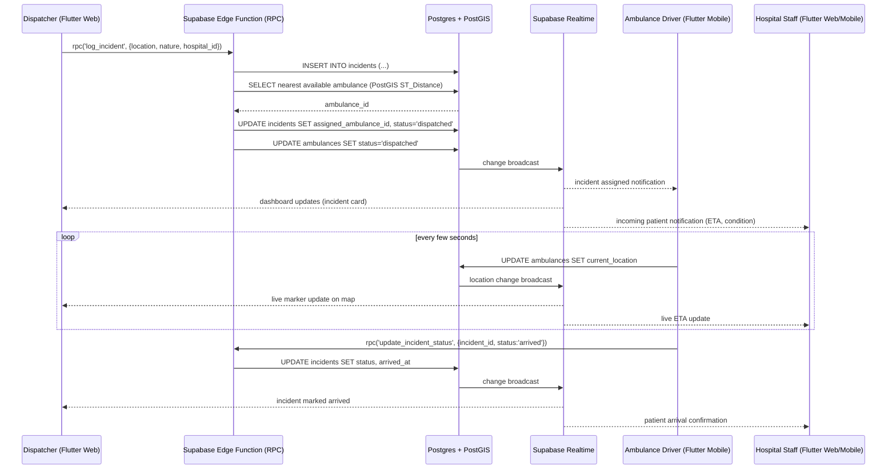
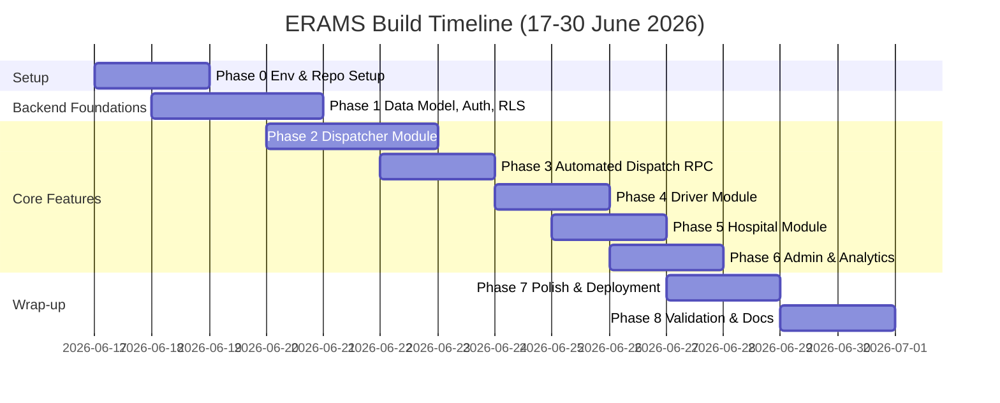

# ERAMS Technical Build Plan
## Emergency Response and Ambulance Management System

**Project:** Final Year Project, Department of Computer Science, Kyambogo University
**Team:** Ashaba Ritah, Ochiria Elias Onyait, Katusiime Eugene, Ashaka Joseph
**Supervisor:** Ms. Shallon Ahimbisibwe
**Document purpose:** This is the canonical technical reference for building ERAMS. It supersedes the technology stack described in Chapter 3 (Section 3.8) and the Project Budget appendix of the original proposal, which referenced Django/PHP + React/MySQL. The system will instead be built as a **single Flutter codebase** deployed cross-platform (web, mobile, desktop), with **Firebase Hosting** for the web frontend and **Supabase** as the backend-as-a-service (Postgres database, Auth, Realtime, Storage, Edge Functions/RPC).

**Build window:** 17 June 2026 – 30 June 2026 (14 days), aligned with Phase 5 and Phase 6 of the original proposal timeline, immediately following the university examination period (1–16 June 2026). Given the compressed timeline, this plan assumes AI-assisted development using Claude Code, with modules built incrementally and validated against this document at each step.

---

## 1. Project Context (from stakeholder research)

This section is retained from the proposal's stakeholder interviews and questionnaires, and should directly inform feature prioritization and edge-case handling.

### 1.1 Case Study Sites

| Site | Type | Current State | Key Pain Points |
| --- | --- | --- | --- |
| **Healthstone Hospital, Banda** (Nakawa Division, Kampala) | Private, mid-sized | Fully manual: telephone + paper logbooks | No GPS tracking at all; vulnerable to power/network outages; communication problems rated "very serious"; no incident reporting or analytics |
| **Mulago National Referral Hospital** (Upper Mulago Hill Road, Kampala) | Public, largest national referral facility | Hybrid: toll-free line (0800-100036) + manual logbooks + DHIS2 | Response times routinely exceed 1 hour; no real-time GPS or automated dispatch; DHIS2 reporting frequently incomplete due to connectivity; must support **role-based authentication per MoH digital health guidelines** |

### 1.2 Implications for the Build

- **Offline resilience is a first-class requirement**, not an afterthought — both sites cited power and connectivity interruptions as major operational issues. Flutter's local persistence (e.g. `drift`/SQLite or `Hive`) combined with Supabase's sync-on-reconnect pattern should be designed in from Phase 1.
- **Role-based access control (RBAC)** is mandatory: Dispatcher, Ambulance Driver, Doctor/Nurse (Hospital), Administrator — modeled directly off Supabase Auth + Postgres Row Level Security (RLS), satisfying the MoH requirement for username/password role-based authentication.
- **Nearest-available-ambulance dispatch logic** is the core differentiator vs. the current manual process at both sites — this should be implemented as a Supabase Edge Function (RPC) using PostGIS for geospatial queries.
- **ETA / advance notification to hospitals** addresses the explicit Mulago requirement for advance notice of incoming patients with condition and ETA.
- **Optional DHIS2 export** remains a "nice to have" stretch module (Phase 5+) — not required for MVP given the two-week window, but the data model should not preclude it (keep incident records structured and exportable).

---

## 2. Technology Stack (Updated)

| Layer | Technology | Notes |
| --- | --- | --- |
| **Client codebase** | Flutter (single codebase) | Targets: Web, Android, iOS (stretch), Windows/Desktop (stretch). Web and Android are the primary demo targets. |
| **Web hosting** | Firebase Hosting | Hosts the compiled Flutter web build (`build/web`). Static hosting only — no backend logic lives here. |
| **Backend (BaaS)** | Supabase | Postgres database, Authentication, Realtime subscriptions, Storage (for any documents/photos), Edge Functions (Deno/TypeScript) for RPC-style server logic. |
| **Database** | Supabase Postgres + PostGIS extension | PostGIS enables geospatial "nearest ambulance" queries. |
| **Maps / GPS** | Google Maps Flutter plugin (`google_maps_flutter`) or `flutter_map` (OpenStreetMap, free, no API key) | Given budget constraints noted in the proposal, evaluate `flutter_map` + OSM tiles as a zero-cost fallback if Google Maps quota becomes a concern during demos. |
| **State management** | Riverpod (recommended) or Provider | Riverpod preferred for testability and AI-assisted code generation consistency. |
| **Realtime updates** | Supabase Realtime (Postgres logical replication via websockets) | Used for live ambulance location updates and dispatch status changes. |
| **Auth** | Supabase Auth (email/password) | Roles stored in a `profiles` table linked to `auth.users`, enforced via RLS policies. |
| **CI/CD** | GitHub Actions | Build Flutter web on push to `main`, deploy to Firebase Hosting; deploy Supabase migrations/Edge Functions via Supabase CLI. |
| **Version control** | GitHub (existing repo) | Branching strategy and repo structure defined in Phase 1 below. |

### 2.1 Why this hybrid model works for ERAMS

- **Client-side heavy lifting**: Flutter handles UI, local state, offline caching, and direct Supabase client SDK calls (`supabase_flutter`) for standard CRUD (reads/writes governed by RLS).
- **Server-side heavy lifting via RPC**: Operations that need to be atomic, secure, or computationally non-trivial — e.g., "assign nearest available ambulance," "create incident + notify hospital + update ambulance status" — are implemented as **Postgres functions** (`SECURITY DEFINER` where appropriate) and/or **Supabase Edge Functions**, called from Flutter via `supabase.rpc('function_name', params)`.
- **Firebase is presentation-only**: this avoids running and paying for a second application server. Firebase Hosting simply serves the static Flutter web build; all dynamic behavior is via Supabase.

---
## 3. High-Level Architecture



### 3.1 Roles and Views

| Role | Primary Platform | Key Screens |
| --- | --- | --- |
| Dispatcher | Web (desktop browser) | Login, Dashboard (active incidents map + list), New Incident form, Ambulance fleet status, Dispatch assignment panel |
| Ambulance Driver | Mobile | Login, Incoming dispatch alert, Status toggle (available/en route/busy), Live location sharing, Incident detail |
| Hospital Staff (Doctor/Nurse) | Web/Mobile | Login, Incoming patient notifications (ETA + condition), Incident handoff confirmation |
| Administrator | Web (desktop browser) | Login, User management, Fleet overview, Analytics dashboard (response times, incident history) |

---

## 4. Data Model (Initial ERD)

This is the MVP schema. All tables live in Supabase Postgres. Geospatial columns use PostGIS `geography(Point, 4326)`.



---
## 5. Core Dispatch Flow (Sequence Diagram)



---

## 6. Repository Structure

```
erams/
├── .github/
│   └── workflows/
│       ├── flutter_web_deploy.yml      # Build & deploy to Firebase Hosting
│       └── supabase_deploy.yml          # Push migrations & edge functions
├── lib/
│   ├── main.dart
│   ├── app.dart                         # Root widget, theming, routing
│   ├── core/
│   │   ├── config/                      # Supabase keys (via --dart-define), constants
│   │   ├── theme/
│   │   └── utils/
│   ├── models/                          # Dart data classes (Incident, Ambulance, Profile, Hospital)
│   ├── services/
│   │   ├── supabase_service.dart        # Client init, auth helpers
│   │   ├── incident_service.dart
│   │   ├── ambulance_service.dart
│   │   └── realtime_service.dart
│   ├── state/                           # Riverpod providers
│   ├── features/
│   │   ├── auth/                        # Login, role-based redirect
│   │   ├── dispatcher/                  # Dashboard, incident form, map, fleet panel
│   │   ├── driver/                      # Status toggle, location sharing, alerts
│   │   ├── hospital/                    # Incoming patient view
│   │   └── admin/                       # User mgmt, analytics
│   └── widgets/                         # Shared widgets (map widget, status badge, etc.)
├── supabase/
│   ├── config.toml
│   ├── migrations/                      # SQL migration files (schema, RLS policies, PostGIS)
│   ├── functions/                       # Edge Functions (Deno/TS)
│   │   ├── log_incident/
│   │   ├── assign_nearest_ambulance/
│   │   └── update_incident_status/
│   └── seed.sql                         # Demo data: hospitals, sample ambulances
├── web/                                 # Flutter web platform files
├── test/                                # Unit & widget tests
├── .gitignore
├── analysis_options.yaml
├── pubspec.yaml
├── firebase.json
├── .firebaserc
└── README.md
```

---

## 7. Build Phases (Module-by-Module)

Each phase below is scoped to be completed with AI-assisted development (Claude Code) and should produce a working, demoable increment. Target dates assume work begins **17 June 2026** and the system must be feature-complete and deployed by **30 June 2026**.

### Phase 0 — Environment & Repository Setup (17–18 June, 2 days)

**Goal:** A working Flutter project connected to Supabase, deployable to Firebase Hosting, with CI scaffolding.

Tasks:
- Initialize Flutter project (`flutter create erams --platforms=web,android,windows`)
- Set up repo structure as in Section 6 above
- Configure `.gitignore` for Flutter (build/, .dart_tool/, *.g.dart if not committing generated code, firebase service account keys, `.env`)
- Write README.md: project overview, setup instructions, environment variables, how to run (`flutter run -d chrome`), how to deploy
- Create Supabase project; enable PostGIS extension; capture project URL + anon key
- Create Firebase project; run `firebase init hosting`; point to `build/web`
- Add `supabase_flutter`, `flutter_riverpod`, `google_maps_flutter` (or `flutter_map`), `go_router` to `pubspec.yaml`
- Set up environment config pattern (e.g. `--dart-define=SUPABASE_URL=... --dart-define=SUPABASE_ANON_KEY=...` or `flutter_dotenv` with `.env` in `.gitignore`)
- Create initial GitHub Actions workflow stubs (can be inactive until later phases)

**Deliverable:** `flutter run -d chrome` shows a placeholder app shell that successfully pings Supabase.

---

### Phase 1 — Data Model, Auth & RLS (18–20 June, 2–3 days)

**Goal:** Database schema live in Supabase with RLS policies enforcing the four roles.

Tasks:
- Write SQL migrations for: `profiles`, `hospitals`, `ambulances`, `incidents`, `incident_events` (per Section 4 ERD)
- Enable PostGIS; add `geography` columns and spatial indexes (`GIST`)
- Configure Supabase Auth (email/password); create trigger to populate `profiles` on `auth.users` insert, defaulting role to `driver` (assignable by admin)
- Write RLS policies per table:
  - Dispatchers: full read/write on `incidents`, `ambulances`
  - Drivers: read own assigned incidents, update own ambulance location/status only
  - Hospital staff: read incidents assigned to their `hospital_id`
  - Admins: full access
- Seed `hospitals` table with Healthstone Hospital (Banda) and Mulago National Referral Hospital records, including approximate coordinates
- Seed a handful of demo ambulances and demo user accounts (one per role) for testing
- Build Flutter `auth` feature: login screen, session persistence, role-based routing (via `go_router` redirect logic reading `profiles.role`)

**Deliverable:** Each of the 4 demo accounts can log in and land on a role-appropriate (even if empty) screen; RLS verified via Supabase SQL editor or Postman against the REST API.

---

### Phase 2 — Dispatcher Module: Incident Logging & Map (20–22 June, 2–3 days)

**Goal:** Dispatcher can log an emergency call and see it on a map alongside ambulance positions.

Tasks:
- Build "New Incident" form: location (map pin drop or address search), nature of emergency, patient condition notes, assigned hospital selector
- Implement map widget showing: incident markers, ambulance markers (color-coded by status), hospital markers
- Wire incident creation to `incidents` table via Supabase client (direct insert is acceptable here; dispatch RPC comes in Phase 3)
- Build Dispatcher Dashboard: list/cards of active incidents with status badges, filterable by status
- Subscribe to Supabase Realtime channel for `incidents` and `ambulances` tables; reflect live changes on map/list without refresh

**Deliverable:** Dispatcher logs a new incident, sees it appear instantly on the dashboard and map.

---

### Phase 3 — Automated Dispatch (RPC/Edge Function) (22–24 June, 2 days)

**Goal:** Nearest-available-ambulance assignment as a server-side, atomic operation.

Tasks:
- Write Postgres function `assign_nearest_ambulance(incident_id uuid)`:
  - Query `ambulances` where `status = 'available'`, order by `ST_Distance(current_location, incident.incident_location)`, limit 1
  - Update `incidents.assigned_ambulance_id`, `incidents.status = 'dispatched'`, `incidents.dispatched_at = now()`
  - Update `ambulances.status = 'dispatched'`
  - Insert `incident_events` row (`event_type = 'status_change'`)
  - All within a single transaction (`SECURITY DEFINER` function)
- Expose via Supabase RPC; call from Flutter as `supabase.rpc('assign_nearest_ambulance', {incident_id: ...})`
- Add "Dispatch" button on the Dispatcher Dashboard for `logged` incidents
- Handle edge case: no ambulance available — surface a clear UI state, allow manual override/assignment by dispatcher
- Write a second function `update_incident_status(incident_id, new_status)` for status transitions (`dispatched → en_route → arrived → completed`), callable by driver and dispatcher roles per RLS

**Deliverable:** Clicking "Dispatch" on an incident automatically assigns the nearest available ambulance and updates both records atomically; tested with seeded ambulance positions at varying distances.

---

### Phase 4 — Driver Module (Mobile) (24–25 June, 2 days)

**Goal:** Ambulance driver receives dispatch alerts, shares live location, updates status.

Tasks:
- Build Driver home screen: current status toggle (available/busy/offline), incoming incident alert card
- On dispatch assignment (via Realtime subscription filtered to driver's `ambulance_id`), show incident details (location, nature, patient notes) with map/navigation link
- Implement periodic location updates: use `geolocator` package to get device location, write to `ambulances.current_location` every N seconds while status is `dispatched`/`en_route` (throttle to balance battery vs. accuracy — e.g. every 10–15 seconds)
- Status transition buttons: "En Route" → "Arrived" → "Completed", each calling `update_incident_status` RPC
- Handle offline queuing: if location update or status change fails due to connectivity, queue locally (e.g. with `Hive` or `sqflite`) and retry on reconnect — directly addresses the power/connectivity issues raised by both Healthstone and Mulago

**Deliverable:** On a physical/emulated device, driver receives a live alert when dispatched, location updates appear on the dispatcher's map in near real time, and status changes propagate correctly.

---

### Phase 5 — Hospital Module & Notifications (25–26 June, 1–2 days)

**Goal:** Hospital staff see incoming patients with ETA and condition ahead of arrival.

Tasks:
- Build Hospital view: list of incidents assigned to the logged-in user's `hospital_id`, filtered to active statuses
- Display incident detail: patient condition notes, current ambulance location, computed/estimated ETA (simple straight-line distance / average speed estimate is acceptable for MVP; can be refined later with a routing API)
- Realtime subscription so new assignments and location updates appear without refresh
- Add "Acknowledge" / "Ready to receive" action for hospital staff (writes an `incident_events` entry)

**Deliverable:** When an incident is dispatched to Mulago or Healthstone (per seeded hospital records), the corresponding hospital-role account sees the incoming patient card update live.

---

### Phase 6 — Admin Module: Fleet & Analytics (26–27 June, 1–2 days)

**Goal:** Administrator can manage users/ambulances and view basic performance analytics.

Tasks:
- Build Admin screens: list/manage `profiles` (assign roles), list/manage `ambulances` (add/edit, assign driver, set home hospital)
- Build basic analytics view: average response time (created_at → arrived_at), incident counts by status, incidents by hospital — simple charts (e.g. `fl_chart`) backed by a Postgres view or aggregate query
- This module directly satisfies the proposal's requirement for a "reporting and analytics module for performance evaluation"

**Deliverable:** Admin can create/edit ambulance records and view a dashboard summarizing incident counts and average response times from seeded/test data.

---

### Phase 7 — Cross-Platform Polish, Offline Hardening & Deployment (27–29 June, 2 days)

**Goal:** Production-ready build across targets, deployed and demoable.

Tasks:
- Responsive layout pass: verify Dispatcher/Admin views work on desktop browser widths; Driver/Hospital views work on mobile widths
- Offline-first review: confirm local caching strategy for incident lists and ambulance statuses degrades gracefully when Supabase connection drops, and syncs on reconnect (addresses both hospitals' stated connectivity issues)
- Build and deploy Flutter web to Firebase Hosting via GitHub Actions (`flutter build web --release` → `firebase deploy --only hosting`)
- Build Android APK for driver demo device
- Finalize Supabase migrations and seed data for the demo (both case study hospitals, realistic ambulance positions around Kampala)
- Smoke-test the full flow end-to-end: dispatcher logs incident → auto-assignment → driver receives alert → location updates live → hospital sees ETA → status completes → appears in admin analytics

**Deliverable:** Live Firebase-hosted web app + installable APK, full dispatch flow working end-to-end against seeded Kampala data for Healthstone and Mulago.

---

### Phase 8 — Validation, Documentation & Demo Prep (29–30 June, 1–2 days)

**Goal:** Wrap-up aligned with Phase 5/6 of the original proposal (validation, final report support).

Tasks:
- Prepare a short structured evaluation form (mirroring the original questionnaire's Section F: ease of use, GPS accuracy, dispatch speed, communication effectiveness) for any informal user walkthroughs
- Update README with final setup/deployment instructions, architecture diagram, and known limitations (e.g. ETA is straight-line estimate, DHIS2 export not implemented)
- Capture screenshots/screen recordings of each role's flow for the final report and oral defense
- Tag a release in GitHub (`v1.0-demo`)

**Deliverable:** Documentation and artifacts ready to support Chapters 5–6 of the final report and the oral defense.

---
## 8. Timeline at a Glance



*Note: Phases overlap deliberately given the compressed window — e.g. Phase 1 (Auth/RLS) can continue while Phase 2 (Dispatcher UI) begins against mock/seed data, similar to the parallel backend/frontend approach in the original proposal.*

---

## 9. Open Questions / Decisions Needed Before Phase 0

- **Maps provider**: confirm `google_maps_flutter` (requires API key + billing setup, though within free credit) vs. `flutter_map` + OpenStreetMap (zero cost, slightly less polished). Recommendation: start with `flutter_map` to avoid API key setup overhead during the short build window; swap later if needed.
- **Desktop target**: confirm whether a native desktop build (Windows/macOS) is needed for the demo, or whether "desktop" just means the responsive web app viewed on a desktop browser. This affects Phase 7 scope.
- **ETA calculation**: confirm straight-line/average-speed estimate is acceptable for MVP vs. integrating a routing API (e.g. OSRM, Google Directions) — routing APIs add complexity and potential cost.
- **DHIS2 export**: confirm this remains out of scope for the build (proposal lists it as "optional") — recommend deferring entirely given the 2-week window.
- **GitHub repo**: confirm the existing repo's current state (empty vs. has prior Django/React scaffolding) so Phase 0 can plan a clean slate vs. migration.

---

## 10. Reference: Mapping to Original Proposal Sections

| Original Proposal Reference | Status in This Plan |
| --- | --- |
| Section 3.6 (User/Functional/Non-Functional/System Requirements) | Retained as-is; informs Sections 1–5 of this document |
| Section 3.7 (DFDs, UML, ERDs) | ERD provided in Section 4; DFD/UML diagrams to be added incrementally per the user's request as each module is built |
| Section 3.8 (System Implementation: Flutter + PHP/MySQL + REST API) | **Superseded** — replaced by Flutter + Supabase + Firebase Hosting (Section 2) |
| Budget Section C (Railway/Vercel/Django hosting) | **Superseded** — replaced by Supabase + Firebase free tiers; no cost impact to overall budget |
| Project Implementation Timeline, Phases 3–6 | **Superseded** — replaced by Section 7/8 of this document, compressed into the 17–30 June window |

---

*This document will be extended with additional Mermaid diagrams (DFDs, UML use case/sequence diagrams per module, screen flow diagrams) as each phase is built, per team request.*
