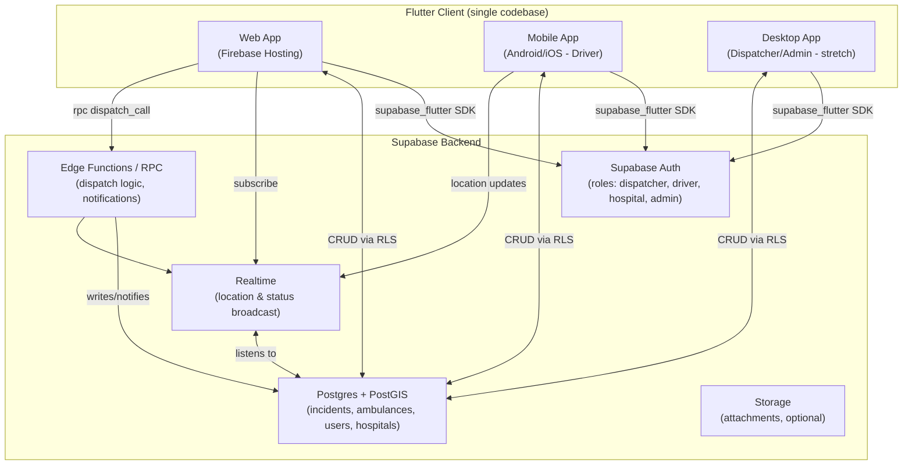
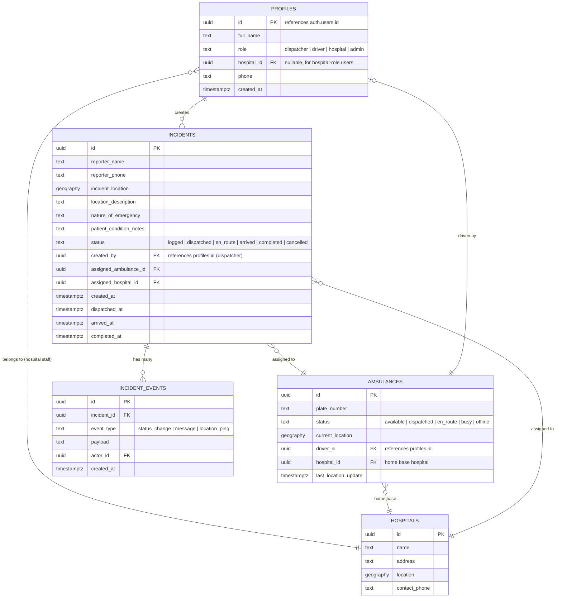
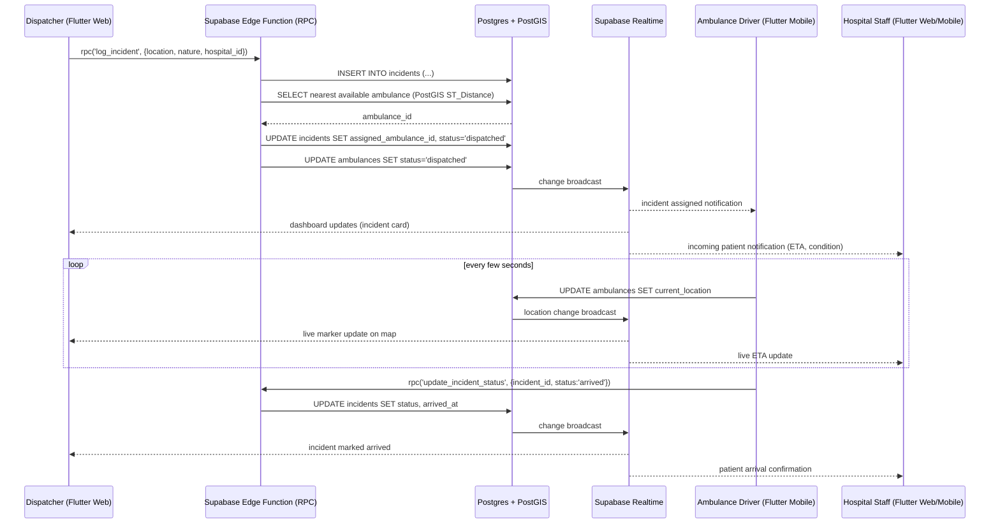
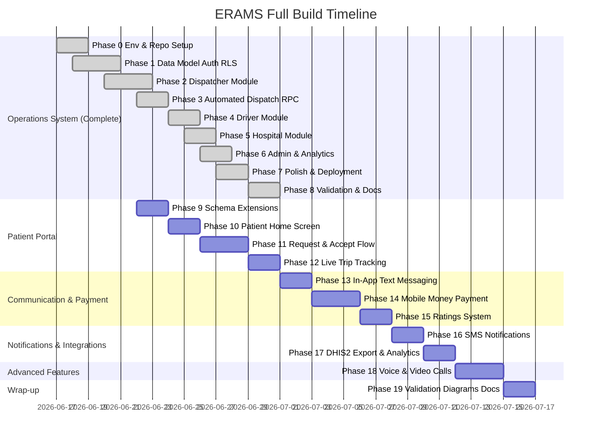

# ERAMS Technical Build Plan
## Emergency Response and Ambulance Management System

**Project:** Final Year Project, Department of Computer Science, Kyambogo University
**Team:** Ashaba Ritah, Ochiria Elias Onyait, Katusiime Eugene, Ashaka Joseph
**Supervisor:** Ms. Shallon Ahimbisibwe
**Document purpose:** This is the canonical technical reference for building ERAMS. It supersedes the technology stack described in Chapter 3 (Section 3.8) and the Project Budget appendix of the original proposal, which referenced Django/PHP + React/MySQL. The system will instead be built as a **single Flutter codebase** deployed cross-platform (web, mobile, desktop), with **Firebase Hosting** for the web frontend and **Supabase** as the backend-as-a-service (Postgres database, Auth, Realtime, Storage, Edge Functions/RPC).

**Build window:** 17 June 2026 – 30 June 2026 (14 days), aligned with Phase 5 and Phase 6 of the original proposal timeline, immediately following the university examination period (1–16 June 2026). Given the compressed timeline, this plan assumes AI-assisted development using Claude Code, with modules built incrementally and validated against this document at each step.

---

## 1. Project Context (from stakeholder research)

This section is retained from the proposal's stakeholder interviews and questionnaires, and should directly inform feature prioritization and edge-case handling.

### 1.1 Case Study Sites

| Site | Type | Current State | Key Pain Points |
| --- | --- | --- | --- |
| **Healthstone Hospital, Banda** (Nakawa Division, Kampala) | Private, mid-sized | Fully manual: telephone + paper logbooks | No GPS tracking at all; vulnerable to power/network outages; communication problems rated "very serious"; no incident reporting or analytics |
| **Mulago National Referral Hospital** (Upper Mulago Hill Road, Kampala) | Public, largest national referral facility | Hybrid: toll-free line (0800-100036) + manual logbooks + DHIS2 | Response times routinely exceed 1 hour; no real-time GPS or automated dispatch; DHIS2 reporting frequently incomplete due to connectivity; must support **role-based authentication per MoH digital health guidelines** |

### 1.2 Implications for the Build

- **Offline resilience is a first-class requirement**, not an afterthought — both sites cited power and connectivity interruptions as major operational issues. Flutter's local persistence (e.g. `drift`/SQLite or `Hive`) combined with Supabase's sync-on-reconnect pattern should be designed in from Phase 1.
- **Role-based access control (RBAC)** is mandatory: Dispatcher, Ambulance Driver, Doctor/Nurse (Hospital), Administrator — modeled directly off Supabase Auth + Postgres Row Level Security (RLS), satisfying the MoH requirement for username/password role-based authentication.
- **Nearest-available-ambulance dispatch logic** is the core differentiator vs. the current manual process at both sites — this should be implemented as a Supabase Edge Function (RPC) using PostGIS for geospatial queries.
- **ETA / advance notification to hospitals** addresses the explicit Mulago requirement for advance notice of incoming patients with condition and ETA.
- **Optional DHIS2 export** remains a "nice to have" stretch module (Phase 5+) — not required for MVP given the two-week window, but the data model should not preclude it (keep incident records structured and exportable).

---

## 2. Technology Stack (Updated)

| Layer | Technology | Notes |
| --- | --- | --- |
| **Client codebase** | Flutter (single codebase) | Targets: Web, Android, iOS (stretch), Windows/Desktop (stretch). Web and Android are the primary demo targets. |
| **Web hosting** | Firebase Hosting | Hosts the compiled Flutter web build (`build/web`). Static hosting only — no backend logic lives here. |
| **Backend (BaaS)** | Supabase | Postgres database, Authentication, Realtime subscriptions, Storage (for any documents/photos), Edge Functions (Deno/TypeScript) for RPC-style server logic. |
| **Database** | Supabase Postgres + PostGIS extension | PostGIS enables geospatial "nearest ambulance" queries. |
| **Maps / GPS** | Google Maps Flutter plugin (`google_maps_flutter`) or `flutter_map` (OpenStreetMap, free, no API key) | Given budget constraints noted in the proposal, evaluate `flutter_map` + OSM tiles as a zero-cost fallback if Google Maps quota becomes a concern during demos. |
| **State management** | Riverpod (recommended) or Provider | Riverpod preferred for testability and AI-assisted code generation consistency. |
| **Realtime updates** | Supabase Realtime (Postgres logical replication via websockets) | Used for live ambulance location updates and dispatch status changes. |
| **Auth** | Supabase Auth (email/password) | Roles stored in a `profiles` table linked to `auth.users`, enforced via RLS policies. |
| **CI/CD** | GitHub Actions | Build Flutter web on push to `main`, deploy to Firebase Hosting; deploy Supabase migrations/Edge Functions via Supabase CLI. |
| **Version control** | GitHub (existing repo) | Branching strategy and repo structure defined in Phase 1 below. |

### 2.1 Why this hybrid model works for ERAMS

- **Client-side heavy lifting**: Flutter handles UI, local state, offline caching, and direct Supabase client SDK calls (`supabase_flutter`) for standard CRUD (reads/writes governed by RLS).
- **Server-side heavy lifting via RPC**: Operations that need to be atomic, secure, or computationally non-trivial — e.g., "assign nearest available ambulance," "create incident + notify hospital + update ambulance status" — are implemented as **Postgres functions** (`SECURITY DEFINER` where appropriate) and/or **Supabase Edge Functions**, called from Flutter via `supabase.rpc('function_name', params)`.
- **Firebase is presentation-only**: this avoids running and paying for a second application server. Firebase Hosting simply serves the static Flutter web build; all dynamic behavior is via Supabase.

---
## 3. High-Level Architecture



### 3.1 Roles and Views

| Role | Primary Platform | Key Screens |
| --- | --- | --- |
| Dispatcher | Web (desktop browser) | Login, Dashboard (active incidents map + list), New Incident form, Ambulance fleet status, Dispatch assignment panel |
| Ambulance Driver | Mobile | Login, Incoming dispatch alert, Status toggle (available/en route/busy), Live location sharing, Incident detail |
| Hospital Staff (Doctor/Nurse) | Web/Mobile | Login, Incoming patient notifications (ETA + condition), Incident handoff confirmation |
| Administrator | Web (desktop browser) | Login, User management, Fleet overview, Analytics dashboard (response times, incident history) |

---

## 4. Data Model (Initial ERD)

This is the MVP schema. All tables live in Supabase Postgres. Geospatial columns use PostGIS `geography(Point, 4326)`.



### 4.1 Extended Schema — Patient Portal (Phase 9)

The following additions are required to support the patient-initiated ride-hailing flow shown in the prototype.

**Extended `AMBULANCES` table (new columns):**
```sql
service_type   text    -- 'BLS' | 'ALS' | 'ICU'
base_fare      numeric -- flat booking fee (UGX)
price_per_km   numeric -- per-km rate (UGX)
rating         numeric -- rolling average 1.0–5.0, updated on trip completion
equipment_notes text   -- free-text list of carried equipment/services
```

**New `TRIPS` table** (extends incidents with patient-facing fields):
```sql
TRIPS {
    uuid id PK
    uuid incident_id FK   "references incidents.id"
    uuid patient_id FK    "references profiles.id (patient role)"
    text payment_method   "'mobile_money' | 'cash' | 'card'"
    text payment_status   "'pending' | 'paid' | 'failed' | 'cash_pending'"
    numeric fare_amount   "calculated at booking (UGX)"
    text payment_ref      "Flutterwave/MoMo transaction reference"
    integer patient_rating  "1–5, submitted after completion"
    text patient_comment
    timestamptz driver_offered_at
    timestamptz driver_accepted_at
    timestamptz driver_declined_at
    timestamptz created_at
}
```

**New `MESSAGES` table** (shared by patient↔driver and dispatcher↔driver):
```sql
MESSAGES {
    uuid id PK
    uuid incident_id FK
    uuid sender_id FK     "references profiles.id"
    text body
    text message_type     "'text' | 'system'"
    timestamptz sent_at
    timestamptz read_at   "nullable"
}
```

---
## 5. Core Dispatch Flow (Sequence Diagram)



---

## 6. Repository Structure

```
erams/
├── .github/
│   └── workflows/
│       ├── flutter_web_deploy.yml      # Build & deploy to Firebase Hosting
│       └── supabase_deploy.yml          # Push migrations & edge functions
├── lib/
│   ├── main.dart
│   ├── app.dart                         # Root widget, theming, routing
│   ├── core/
│   │   ├── config/                      # Supabase keys (via --dart-define), constants
│   │   ├── theme/
│   │   └── utils/
│   ├── models/                          # Dart data classes (Incident, Ambulance, Profile, Hospital)
│   ├── services/
│   │   ├── supabase_service.dart        # Client init, auth helpers
│   │   ├── incident_service.dart
│   │   ├── ambulance_service.dart
│   │   └── realtime_service.dart
│   ├── state/                           # Riverpod providers
│   ├── features/
│   │   ├── auth/                        # Login, role-based redirect
│   │   ├── dispatcher/                  # Dashboard, incident form, map, fleet panel
│   │   ├── driver/                      # Status toggle, location sharing, alerts
│   │   ├── hospital/                    # Incoming patient view
│   │   └── admin/                       # User mgmt, analytics
│   └── widgets/                         # Shared widgets (map widget, status badge, etc.)
├── supabase/
│   ├── config.toml
│   ├── migrations/                      # SQL migration files (schema, RLS policies, PostGIS)
│   ├── functions/                       # Edge Functions (Deno/TS)
│   │   ├── log_incident/
│   │   ├── assign_nearest_ambulance/
│   │   └── update_incident_status/
│   └── seed.sql                         # Demo data: hospitals, sample ambulances
├── web/                                 # Flutter web platform files
├── test/                                # Unit & widget tests
├── .gitignore
├── analysis_options.yaml
├── pubspec.yaml
├── firebase.json
├── .firebaserc
└── README.md
```

---

## 7. Build Phases (Module-by-Module)

Each phase below is scoped to be completed with AI-assisted development (Claude Code) and should produce a working, demoable increment. Target dates assume work begins **17 June 2026** and the system must be feature-complete and deployed by **30 June 2026**.

### Phase 0 — Environment & Repository Setup (17–18 June, 2 days)

**Goal:** A working Flutter project connected to Supabase, deployable to Firebase Hosting, with CI scaffolding.

Tasks:
- Initialize Flutter project (`flutter create erams --platforms=web,android,windows`)
- Set up repo structure as in Section 6 above
- Configure `.gitignore` for Flutter (build/, .dart_tool/, *.g.dart if not committing generated code, firebase service account keys, `.env`)
- Write README.md: project overview, setup instructions, environment variables, how to run (`flutter run -d chrome`), how to deploy
- Create Supabase project; enable PostGIS extension; capture project URL + anon key
- Create Firebase project; run `firebase init hosting`; point to `build/web`
- Add `supabase_flutter`, `flutter_riverpod`, `google_maps_flutter` (or `flutter_map`), `go_router` to `pubspec.yaml`
- Set up environment config pattern (e.g. `--dart-define=SUPABASE_URL=... --dart-define=SUPABASE_ANON_KEY=...` or `flutter_dotenv` with `.env` in `.gitignore`)
- Create initial GitHub Actions workflow stubs (can be inactive until later phases)

**Deliverable:** `flutter run -d chrome` shows a placeholder app shell that successfully pings Supabase.

---

### Phase 1 — Data Model, Auth & RLS (18–20 June, 2–3 days)

**Goal:** Database schema live in Supabase with RLS policies enforcing the four roles.

Tasks:
- Write SQL migrations for: `profiles`, `hospitals`, `ambulances`, `incidents`, `incident_events` (per Section 4 ERD)
- Enable PostGIS; add `geography` columns and spatial indexes (`GIST`)
- Configure Supabase Auth (email/password); create trigger to populate `profiles` on `auth.users` insert, defaulting role to `driver` (assignable by admin)
- Write RLS policies per table:
  - Dispatchers: full read/write on `incidents`, `ambulances`
  - Drivers: read own assigned incidents, update own ambulance location/status only
  - Hospital staff: read incidents assigned to their `hospital_id`
  - Admins: full access
- Seed `hospitals` table with Healthstone Hospital (Banda) and Mulago National Referral Hospital records, including approximate coordinates
- Seed a handful of demo ambulances and demo user accounts (one per role) for testing
- Build Flutter `auth` feature: login screen, session persistence, role-based routing (via `go_router` redirect logic reading `profiles.role`)

**Deliverable:** Each of the 4 demo accounts can log in and land on a role-appropriate (even if empty) screen; RLS verified via Supabase SQL editor or Postman against the REST API.

---

### Phase 2 — Dispatcher Module: Incident Logging & Map (20–22 June, 2–3 days)

**Goal:** Dispatcher can log an emergency call and see it on a map alongside ambulance positions.

Tasks:
- Build "New Incident" form: location (map pin drop or address search), nature of emergency, patient condition notes, assigned hospital selector
- Implement map widget showing: incident markers, ambulance markers (color-coded by status), hospital markers
- Wire incident creation to `incidents` table via Supabase client (direct insert is acceptable here; dispatch RPC comes in Phase 3)
- Build Dispatcher Dashboard: list/cards of active incidents with status badges, filterable by status
- Subscribe to Supabase Realtime channel for `incidents` and `ambulances` tables; reflect live changes on map/list without refresh

**Deliverable:** Dispatcher logs a new incident, sees it appear instantly on the dashboard and map.

---

### Phase 3 — Automated Dispatch (RPC/Edge Function) (22–24 June, 2 days)

**Goal:** Nearest-available-ambulance assignment as a server-side, atomic operation.

Tasks:
- Write Postgres function `assign_nearest_ambulance(incident_id uuid)`:
  - Query `ambulances` where `status = 'available'`, order by `ST_Distance(current_location, incident.incident_location)`, limit 1
  - Update `incidents.assigned_ambulance_id`, `incidents.status = 'dispatched'`, `incidents.dispatched_at = now()`
  - Update `ambulances.status = 'dispatched'`
  - Insert `incident_events` row (`event_type = 'status_change'`)
  - All within a single transaction (`SECURITY DEFINER` function)
- Expose via Supabase RPC; call from Flutter as `supabase.rpc('assign_nearest_ambulance', {incident_id: ...})`
- Add "Dispatch" button on the Dispatcher Dashboard for `logged` incidents
- Handle edge case: no ambulance available — surface a clear UI state, allow manual override/assignment by dispatcher
- Write a second function `update_incident_status(incident_id, new_status)` for status transitions (`dispatched → en_route → arrived → completed`), callable by driver and dispatcher roles per RLS

**Deliverable:** Clicking "Dispatch" on an incident automatically assigns the nearest available ambulance and updates both records atomically; tested with seeded ambulance positions at varying distances.

---

### Phase 4 — Driver Module (Mobile) (24–25 June, 2 days)

**Goal:** Ambulance driver receives dispatch alerts, shares live location, updates status.

Tasks:
- Build Driver home screen: current status toggle (available/busy/offline), incoming incident alert card
- On dispatch assignment (via Realtime subscription filtered to driver's `ambulance_id`), show incident details (location, nature, patient notes) with map/navigation link
- Implement periodic location updates: use `geolocator` package to get device location, write to `ambulances.current_location` every N seconds while status is `dispatched`/`en_route` (throttle to balance battery vs. accuracy — e.g. every 10–15 seconds)
- Status transition buttons: "En Route" → "Arrived" → "Completed", each calling `update_incident_status` RPC
- Handle offline queuing: if location update or status change fails due to connectivity, queue locally (e.g. with `Hive` or `sqflite`) and retry on reconnect — directly addresses the power/connectivity issues raised by both Healthstone and Mulago

**Deliverable:** On a physical/emulated device, driver receives a live alert when dispatched, location updates appear on the dispatcher's map in near real time, and status changes propagate correctly.

---

### Phase 5 — Hospital Module & Notifications (25–26 June, 1–2 days)

**Goal:** Hospital staff see incoming patients with ETA and condition ahead of arrival.

Tasks:
- Build Hospital view: list of incidents assigned to the logged-in user's `hospital_id`, filtered to active statuses
- Display incident detail: patient condition notes, current ambulance location, computed/estimated ETA (simple straight-line distance / average speed estimate is acceptable for MVP; can be refined later with a routing API)
- Realtime subscription so new assignments and location updates appear without refresh
- Add "Acknowledge" / "Ready to receive" action for hospital staff (writes an `incident_events` entry)

**Deliverable:** When an incident is dispatched to Mulago or Healthstone (per seeded hospital records), the corresponding hospital-role account sees the incoming patient card update live.

---

### Phase 6 — Admin Module: Fleet & Analytics (26–27 June, 1–2 days)

**Goal:** Administrator can manage users/ambulances and view basic performance analytics.

Tasks:
- Build Admin screens: list/manage `profiles` (assign roles), list/manage `ambulances` (add/edit, assign driver, set home hospital)
- Build basic analytics view: average response time (created_at → arrived_at), incident counts by status, incidents by hospital — simple charts (e.g. `fl_chart`) backed by a Postgres view or aggregate query
- This module directly satisfies the proposal's requirement for a "reporting and analytics module for performance evaluation"

**Deliverable:** Admin can create/edit ambulance records and view a dashboard summarizing incident counts and average response times from seeded/test data.

---

### Phase 7 — Cross-Platform Polish, Offline Hardening & Deployment (27–29 June, 2 days)

**Goal:** Production-ready build across targets, deployed and demoable.

Tasks:
- Responsive layout pass: verify Dispatcher/Admin views work on desktop browser widths; Driver/Hospital views work on mobile widths
- Offline-first review: confirm local caching strategy for incident lists and ambulance statuses degrades gracefully when Supabase connection drops, and syncs on reconnect (addresses both hospitals' stated connectivity issues)
- Build and deploy Flutter web to Firebase Hosting via GitHub Actions (`flutter build web --release` → `firebase deploy --only hosting`)
- Build Android APK for driver demo device
- Finalize Supabase migrations and seed data for the demo (both case study hospitals, realistic ambulance positions around Kampala)
- Smoke-test the full flow end-to-end: dispatcher logs incident → auto-assignment → driver receives alert → location updates live → hospital sees ETA → status completes → appears in admin analytics

**Deliverable:** Live Firebase-hosted web app + installable APK, full dispatch flow working end-to-end against seeded Kampala data for Healthstone and Mulago.

---

### Phase 8 — Validation, Documentation & Demo Prep (29–30 June, 1–2 days)

**Goal:** Wrap-up aligned with Phase 5/6 of the original proposal (validation, final report support).

Tasks:
- Prepare a short structured evaluation form (mirroring the original questionnaire's Section F: ease of use, GPS accuracy, dispatch speed, communication effectiveness) for any informal user walkthroughs
- Update README with final setup/deployment instructions, architecture diagram, and known limitations (e.g. ETA is straight-line estimate, DHIS2 export not implemented)
- Capture screenshots/screen recordings of each role's flow for the final report and oral defense
- Tag a release in GitHub (`v1.0-demo`)

**Deliverable:** Documentation and artifacts ready to support Chapters 5–6 of the final report and the oral defense.

---
---

> **Phases 0–8 are complete.** Everything below (Phases 9–19) covers the remaining patient-facing features identified in the prototype gap analysis (Section 11). Each phase is self-contained and produces a demoable increment before the next phase starts.

---

### Phase 9 — Schema Extensions & Ambulance Marketplace Data

**Goal:** Lay the database foundation for everything in Phases 10–19. No Flutter UI yet — this phase is purely backend so all future phases build on solid ground.

**Why first:** Every subsequent phase depends on these tables and columns existing. Doing schema work up-front means no migration conflicts later.

Tasks:
- Migration `006_patient_role.sql`:
  - Add `'patient'` to the `profiles.role` check constraint (or enum)
  - Add RLS policies for `patient` role: can read own profile, read available ambulances, read/write own trips and messages
- Migration `007_ambulance_marketplace.sql`:
  - Add to `ambulances`: `service_type text DEFAULT 'BLS'` (BLS / ALS / ICU), `base_fare numeric DEFAULT 0`, `price_per_km numeric DEFAULT 0`, `rating numeric DEFAULT 0`, `rating_count integer DEFAULT 0`, `equipment_notes text DEFAULT ''`
- Migration `008_trips.sql`:
  - Create `trips` table: `id uuid PK`, `incident_id uuid FK → incidents`, `patient_id uuid FK → profiles`, `payment_method text` (mobile_money / cash / card), `payment_status text DEFAULT 'pending'` (pending / paid / failed / cash_pending), `fare_amount numeric DEFAULT 0`, `payment_ref text`, `patient_rating integer` (1–5, nullable), `patient_comment text`, `driver_offered_at timestamptz`, `driver_accepted_at timestamptz`, `driver_declined_at timestamptz`, `created_at timestamptz DEFAULT now()`
  - Enable RLS; policies: patient reads/writes own trips; driver reads trips for their ambulance; admin full access
- Migration `009_messages.sql`:
  - Create `messages` table: `id uuid PK`, `incident_id uuid FK → incidents`, `sender_id uuid FK → profiles`, `body text`, `message_type text DEFAULT 'text'`, `sent_at timestamptz DEFAULT now()`, `read_at timestamptz`
  - Enable RLS; policies: sender and the other party on the incident can read/write; admin read-all
  - Enable Realtime publication for `messages` table
- Update `ambulances` seed data: set `service_type`, `base_fare`, `price_per_km`, `equipment_notes` for the 5 demo ambulances
- Update `lib/models/ambulance.dart`: add `serviceType`, `baseFare`, `pricePerKm`, `rating`, `ratingCount`, `equipmentNotes` fields + `fromJson`/`toJson`
- Update Admin Fleet tab: show `service_type` badge on each ambulance card; add `service_type`, `base_fare`, `price_per_km` fields to the Add/Edit Ambulance form

**Deliverable:** All new tables exist in Supabase with correct RLS. Admin can set service type and pricing on ambulances. `flutter analyze` passes. No Flutter screens yet.

---

### Phase 10 — Patient Registration, Login & Home Screen

**Goal:** A patient can register, log in, and see a live map of available ambulances near them.

Tasks:
- Extend `lib/features/auth/login_screen.dart`: add "Register as Patient" link → registration form (full name, phone, email, password)
- `AuthService.registerPatient()`: creates Supabase auth user + `profiles` row with `role = 'patient'`
- Add `/patient` route to GoRouter in `app.dart`; redirect logic: `patient` role → `/patient`
- Build `lib/features/patient/patient_home_screen.dart`:
  - Map centred on patient's GPS location (uses `geolocator`)
  - Fetches available ambulances (`status = 'available'`) and plots numbered markers on map (matching prototype: green numbered pins 01, 02, 03…)
  - Each marker tap shows a small card: ambulance number, service type badge (BLS/ALS/ICU), distance from patient, base fare (UGX), star rating
  - Counter chip at bottom: *"X ambulances available nearby"*
  - Large "Request Ambulance" button at bottom
  - App bar: ERAMS logo, profile icon, sign out
- `lib/services/patient_service.dart`: `fetchNearbyAmbulances(lat, lng)` — queries available ambulances ordered by PostGIS `ST_Distance` from patient location
- `lib/state/patient_provider.dart`: `nearbyAmbulancesProvider`, `patientLocationProvider`
- Web GPS guard (same pattern as driver — skip location on `kIsWeb` unless browser grants permission)

**Deliverable:** Patient logs in (or registers), sees a live map of ambulances near them with service type, distance, and price visible on each marker. Count chip shows how many are available.

---

### Phase 11 — Ambulance Request Form & Driver Accept/Decline

**Goal:** Patient submits a request; the right driver receives and accepts it before the trip begins.

Tasks:
- Build `lib/features/patient/new_request_form.dart`:
  - Emergency type dropdown (same 10 types as dispatcher form)
  - Patient name (pre-filled from profile) and phone
  - Location confirm: shows current GPS pin on mini-map with option to adjust
  - Additional notes / condition description
  - Photo attachment: `ImagePicker` → upload to Supabase Storage bucket `incident-photos`; store public URL in `incidents.photo_url` (add this column via migration)
  - Fare estimate shown before submission: `base_fare + (estimated_distance_km × price_per_km)`
  - "Confirm Request" button
  - On submit: creates `incidents` row + `trips` row (`payment_status = 'pending'`)
- Build `lib/features/patient/ambulance_picker_screen.dart`:
  - Shown after form submission
  - Ranked list of nearby available ambulances: distance chip, service type badge, fare estimate, star rating (filled stars)
  - Each row has an "Select" button
  - On select: calls updated `dispatch_incident` RPC passing `ambulance_id` and `patient_id`
- Update `dispatch_incident` Postgres RPC (new migration):
  - Accept optional `p_patient_id uuid` parameter
  - After selecting the ambulance, insert a row into `trips` (or update existing) linking the incident to the patient
  - Set `trips.driver_offered_at = now()`
  - Do **not** update ambulance to `dispatched` yet — wait for driver accept
  - Set `incidents.status = 'pending_acceptance'` (new status — add to constraint)
- Update `lib/features/driver/driver_screen.dart` — replace silent assignment with **job offer card**:
  - Realtime subscription fires when `incidents.status = 'pending_acceptance'` and `assigned_ambulance_id = driver's ambulance`
  - Full-screen card slides up: patient name, emergency type, distance (km), fare (UGX), location description
  - **Accept** (green) and **Decline** (red) buttons
  - 30-second countdown timer — if no response, auto-decline
  - On Accept: calls new RPC `accept_trip(incident_id)` → sets `trips.driver_accepted_at`, `incidents.status = 'dispatched'`, `ambulances.status = 'dispatched'`
  - On Decline / timeout: calls `decline_trip(incident_id)` → sets `trips.driver_declined_at`, offers job to next nearest available driver (RPC re-runs distance query skipping declined drivers)
- `accept_trip` and `decline_trip` Postgres functions (migration)

**Deliverable:** Patient submits a request with photo, sees nearby ambulances ranked by distance/price, selects one. Driver receives a timed accept/decline card. On accept, both sides move forward; on decline, the next driver is offered the job.

---

### Phase 12 — Live Trip Tracking (Patient Side)

**Goal:** After driver accepts, patient watches the ambulance approach on a live map with a live ETA countdown.

Tasks:
- Build `lib/features/patient/trip_tracking_screen.dart`:
  - Full-screen map showing: patient's pin (blue), ambulance moving marker (green, updates live), hospital marker
  - ETA chip updating every time the ambulance location changes (Haversine ÷ 40 km/h, same formula as hospital screen)
  - Status banner: "Driver accepted — on the way", "Driver has arrived", "En route to hospital", "Completed"
  - Bottom sheet: driver name, ambulance plate, service type, phone number (tap to call via `url_launcher`)
  - Realtime subscription on `ambulances` for position updates and on `incidents` for status changes
- GoRouter redirect: after trip is created and driver accepts, patient is pushed to `/patient/tracking/:incidentId`
- Patient tracking screen dismisses automatically when `incidents.status = 'completed'` and shows completion summary (response time, driver name, fare)
- Update `patient_provider.dart`: `activeTrip​Provider` — watches for patient's active incident

**Deliverable:** Patient sees their driver approaching in real time on a map. ETA counts down live. Status banner updates as driver transitions through En Route → Arrived → Completed.

---

### Phase 13 — In-App Text Messaging (Patient ↔ Driver & Dispatcher ↔ Driver)

**Goal:** Both patient↔driver and dispatcher↔driver can exchange text messages on an active incident.

Tasks:
- Build `lib/widgets/chat_sheet.dart`: reusable bottom-sheet chat widget used by both patient and driver screens
  - Message list (bubbles: sent = right/primary colour, received = left/grey)
  - Text input + send button
  - Realtime subscription on `messages` filtered by `incident_id`
  - Auto-scroll to latest message on new arrival
  - Timestamps on each bubble
- Integrate into patient `trip_tracking_screen.dart`: floating chat FAB → opens `ChatSheet`
- Integrate into driver `driver_screen.dart`: "Message Patient" button on active incident card → opens `ChatSheet`
- Integrate into dispatcher `dispatcher_dashboard.dart`: "Message Driver" button on dispatched/en-route incident cards → opens `ChatSheet`
- `lib/services/message_service.dart`: `sendMessage(incidentId, body)`, `streamMessages(incidentId)` (Supabase Realtime channel)
- `lib/state/message_provider.dart`: `messagesProvider(incidentId)` — `StreamProvider`
- Unread badge on the chat FAB/button when new messages arrive while sheet is closed

**Deliverable:** Patient and driver can text each other in real time on an active trip. Dispatcher can text any driver on an active incident. Messages persist across refreshes.

---

### Phase 14 — Mobile Money Payment (Flutterwave)

**Goal:** Patient pays for the ambulance via MTN Mobile Money, Airtel Money, or card before the driver is dispatched.

Tasks:
- Add `flutterwave_sdk` (or `flutter_wave`) to `pubspec.yaml`
- Payment flow in `ambulance_picker_screen.dart` / `trip_tracking_screen.dart`:
  - After patient selects ambulance, show payment bottom sheet: fare breakdown (base fare + estimated distance fare), payment method selector (MTN MoMo / Airtel Money / Cash / Card)
  - For mobile money: collect phone number, trigger Flutterwave charge API
  - For cash: mark `trips.payment_method = 'cash'`, `payment_status = 'cash_pending'`; proceed immediately
  - For card: Flutterwave inline checkout WebView
- Supabase Edge Function `flutterwave_webhook`: receives Flutterwave payment callback, verifies signature, updates `trips.payment_status = 'paid'`, `trips.payment_ref`, then triggers `dispatch_incident` RPC (payment gate: driver is only offered job after payment confirmed for mobile money / card)
- Cash trips: driver sees "Cash — collect on arrival" note on job card; confirms `cash_received` at trip completion
- Admin Patients tab: show payment method badge and status (Paid / Cash / Pending / Failed) on each patient record card

**Deliverable:** Patient pays via MTN MoMo or Airtel Money. Payment confirmation (or cash selection) unlocks the job offer to the driver. Admin sees payment status on every trip record.

---

### Phase 15 — Ratings System

**Goal:** After every completed trip, patient rates the ambulance. Ratings feed back into the marketplace display.

Tasks:
- Build `lib/features/patient/trip_rating_screen.dart`:
  - Shown automatically when `incidents.status = 'completed'` on the patient's active trip
  - 1–5 interactive star row
  - Optional comment text field
  - "Submit Rating" and "Skip" buttons
- `PatientService.submitRating(incidentId, rating, comment)`: writes `trips.patient_rating` and `trips.patient_comment`
- Postgres trigger `update_ambulance_rating` (migration): fires on `trips.patient_rating` UPDATE; recalculates `ambulances.rating = AVG(patient_rating)` and `ambulances.rating_count` across all completed trips for that ambulance
- Update ambulance cards in `patient_home_screen.dart` and `ambulance_picker_screen.dart`: show filled/half stars from `ambulances.rating`; show rating count (e.g. "4.2 ★ (23)")
- Update Admin Fleet tab: show rating badge on each ambulance card

**Deliverable:** Patient is prompted to rate after every trip. Ratings immediately update the ambulance's star average. New patients see live ratings when browsing available ambulances.

---

### Phase 16 — SMS Notifications (Africa's Talking)

**Goal:** Key events trigger SMS alerts so drivers and patients are notified even when the app is closed.

Tasks:
- Create Africa's Talking account; add `AT_API_KEY` and `AT_USERNAME` to Supabase Edge Function secrets
- Supabase Edge Function `send_sms` (shared helper): wraps Africa's Talking REST API
- Trigger SMS on these events (via database webhooks or existing RPC calls):
  - **Driver new job offer**: "ERAMS: New trip request from [Patient]. Emergency: [type]. Distance: [X]km. Fare: UGX [Y]. Open the app to accept within 30 seconds."
  - **Patient — driver accepted**: "ERAMS: Driver [Name] ([Plate]) has accepted your request. ETA approx [X] min. Track live in the app."
  - **Patient — driver arrived**: "ERAMS: Your ambulance has arrived."
  - **Hospital — incoming patient**: "ERAMS: Incoming patient from [Location]. Emergency: [type]. ETA approx [X] min. Condition: [notes]."
- Add `profiles.phone` validation on registration: must be a valid Uganda number (+256…)
- Graceful fallback: if SMS fails (network, insufficient credits), log the error to `incident_events` but do not block the main flow

**Deliverable:** Driver receives an SMS job offer when the app is backgrounded. Patient gets an SMS confirmation when a driver accepts. Hospital staff get an SMS when a patient is inbound.

---

### Phase 17 — DHIS2 Export & Analytics Enhancements

**Goal:** Admin can export incident data to Uganda's national health reporting system and download a report. Analytics tab matches the prototype's Insights screen.

Tasks:
- Supabase Edge Function `export_to_dhis2`:
  - Accepts `start_date` and `end_date` parameters
  - Queries completed incidents in range, aggregates by emergency type and hospital
  - POSTs summary statistics to DHIS2 Data Value Sets API (`/api/dataValueSets`)
  - Returns success/failure per data element
  - DHIS2 credentials stored as Edge Function secrets (not in client)
- Add "Export to DHIS2" button to Admin Analytics tab → opens date-range picker dialog → calls Edge Function → shows success/error snackbar
- Add "Download Report" button → generates CSV of incidents in date range → triggers browser download via `dart:html` (web) or `share_plus` (mobile)
- Analytics tab enhancements to match prototype Insights screen:
  - Add **fleet utilisation donut chart**: `active ambulances / total fleet × 100%`
  - Add **calls today** KPI card (incidents created today)
  - Add **completion rate** KPI card (completed / total × 100%)
  - Add **response time per call** bar chart (one bar per incident, last 10)
  - Add **calls by emergency type** horizontal bar chart

**Deliverable:** Admin exports incident summary to DHIS2 and downloads a CSV report. Analytics tab matches the prototype's Insights screen exactly.

---

### Phase 18 — Voice & Video Calls (Agora)

**Goal:** Patient and driver can make in-app voice and video calls on an active trip.

Tasks:
- Add `agora_rtc_engine` to `pubspec.yaml`
- Create Agora project; store `AGORA_APP_ID` in `.env` and Edge Function secrets
- Supabase Edge Function `generate_agora_token`: accepts `channelName` (= `incident_id`) + `uid`, generates a short-lived RTC token using Agora token builder; returns token to caller
- Build `lib/widgets/call_screen.dart`:
  - Full-screen call UI: remote video feed (large), local camera feed (small pip), mute/unmute, camera on/off, speaker toggle, end-call button
  - Collapses to audio-only mode automatically if remote camera is off
- Add call buttons to `trip_tracking_screen.dart` (patient side): phone icon (voice) + video camera icon (video)
- Add call buttons to `driver_screen.dart` active incident card: same two icons
- On press: fetch Agora token from Edge Function → join channel `incident_id` → navigate to `CallScreen`
- Android permissions: add `RECORD_AUDIO`, `CAMERA` to `AndroidManifest.xml`
- Web: request browser mic/camera permissions before joining

**Deliverable:** Patient and driver can initiate a voice or video call from within the active trip screen. Both sides can see/hear each other. Call ends cleanly and returns to the trip tracking view.

---

### Phase 19 — Final Validation, Diagrams & Full Report Prep

**Goal:** Complete all documentation required by the proposal (Section 3.7), run end-to-end validation of the full patient flow, and tag the production release.

Tasks:
- **DFD Level 0** (Context Diagram): single process "ERAMS", all external entities (Patient, Driver, Dispatcher, Hospital Staff, Administrator, DHIS2, Flutterwave/MoMo, Africa's Talking), all data flows
- **DFD Level 1** (System Diagram): explode ERAMS into its 6 sub-processes (Request Handling, Dispatch, Location Tracking, Communication, Payment, Reporting), show data stores (Incidents, Ambulances, Profiles, Hospitals, Trips, Messages) and flows between them
- **UML Use Case Diagram**: all 5 roles (Patient, Dispatcher, Driver, Hospital, Admin) + system boundary + all use cases with include/extend relationships
- **UML Sequence Diagrams** (one per major flow):
  - Patient-initiated booking flow (patient → system → driver accept → tracking → hospital notification → completion → rating)
  - Dispatcher-initiated flow (existing, update to include messaging)
  - Payment flow (patient → Flutterwave → webhook → dispatch unlock)
- Save all diagrams as SVG/PNG in `docs/diagrams/`
- Update `EVALUATION_FORM.md`: add Section G for patient experience (ease of booking, ambulance selection, tracking accuracy, communication quality, payment experience)
- Full smoke test of the complete patient flow end-to-end on both web and Android
- Update README: add patient registration instructions, Flutterwave/Agora setup, Africa's Talking setup
- Tag release `v2.0-complete` in GitHub

**Deliverable:** All proposal Section 3.7 diagrams produced and saved. Full end-to-end patient booking flow validated on deployed app. Evaluation form updated. `v2.0-complete` release tagged.

---

## 8. Timeline at a Glance



*Phases 9–19 are sequential — each depends on the previous phase's schema and services being in place. Phase 18 (voice/video) is the most complex and can be skipped for the academic submission if time is short, replacing it with a "planned feature" note in the final report.*

---

## 9. Open Questions / Decisions Needed Before Phase 0

- **Maps provider**: confirm `google_maps_flutter` (requires API key + billing setup, though within free credit) vs. `flutter_map` + OpenStreetMap (zero cost, slightly less polished). Recommendation: start with `flutter_map` to avoid API key setup overhead during the short build window; swap later if needed.
- **Desktop target**: confirm whether a native desktop build (Windows/macOS) is needed for the demo, or whether "desktop" just means the responsive web app viewed on a desktop browser. This affects Phase 7 scope.
- **ETA calculation**: confirm straight-line/average-speed estimate is acceptable for MVP vs. integrating a routing API (e.g. OSRM, Google Directions) — routing APIs add complexity and potential cost.
- **DHIS2 export**: confirm this remains out of scope for the build (proposal lists it as "optional") — recommend deferring entirely given the 2-week window.
- **GitHub repo**: confirm the existing repo's current state (empty vs. has prior Django/React scaffolding) so Phase 0 can plan a clean slate vs. migration.

---

## 10. Reference: Mapping to Original Proposal Sections

| Original Proposal Reference | Status in This Plan |
| --- | --- |
| Section 3.6 (User/Functional/Non-Functional/System Requirements) | Retained as-is; informs Sections 1–5 of this document |
| Section 3.7 (DFDs, UML, ERDs) | ERD provided in Section 4; DFD/UML diagrams to be added incrementally per the user's request as each module is built |
| Section 3.8 (System Implementation: Flutter + PHP/MySQL + REST API) | **Superseded** — replaced by Flutter + Supabase + Firebase Hosting (Section 2) |
| Budget Section C (Railway/Vercel/Django hosting) | **Superseded** — replaced by Supabase + Firebase free tiers; no cost impact to overall budget |
| Project Implementation Timeline, Phases 3–6 | **Superseded** — replaced by Section 7/8 of this document, compressed into the 17–30 June window |

---

## 11. Proposal vs. Built System — Feature Gap Analysis

*Updated 21 June 2026 after full cross-reference of the submitted research proposal (Sections 1.3, 1.5, 3.6, 3.7), the interactive prototype (screens/01-patient.png, portal.png, 02–04-roles.png), and the completed Flutter codebase (Phases 0–8).*

> **Critical finding:** The prototype envisions a **patient-initiated, ride-hailing model** (like SafeBoda / Faras / Uber) where patients self-request ambulances, browse nearby units with pricing and ratings, select one, pay via mobile money, and track the driver live. The built system implements only the **hospital control-room model** — a dispatcher manually logs calls on behalf of patients who phone in. The Patient portal is the core user-facing innovation described in the prototype and it is entirely absent from the current codebase.

### 11.1 Implemented Features (Proposal Requirements Met)

| # | Requirement (from proposal) | Implemented In | Notes |
| --- | --- | --- | --- |
| 1 | Emergency call logging (location, nature, time, reporter info) | `features/dispatcher/new_incident_form.dart` | 10 emergency types, map pin-drop, patient notes |
| 2 | Automated nearest-ambulance dispatch (GPS-based) | `supabase/migrations/…_dispatch_rpcs.sql` + `incident_service.dart` | PostGIS `ST_Distance`, atomic transaction, SECURITY DEFINER |
| 3 | Manual dispatch override | `features/dispatcher/manual_dispatch_dialog.dart` | Fallback when no ambulance available; sorted by distance |
| 4 | Real-time GPS tracking on live map | `state/driver_provider.dart` (`GpsNotifier`) + `features/dispatcher/dispatcher_dashboard.dart` | 15-second upload cadence; Realtime broadcast to map |
| 5 | Role-based access control (4 roles, MoH-compliant) | `supabase/migrations/…_rls_policies.sql` + `app.dart` | RLS per table; GoRouter role-redirect; 4 demo accounts |
| 6 | Hospital advance notification (ETA + patient condition) | `features/hospital/hospital_screen.dart` | Haversine ÷ 40 km/h ETA; live updates via Realtime |
| 7 | Hospital acknowledgement ("Ready to Receive") | `services/hospital_service.dart` — `acknowledgeIncident()` | Writes `incident_events` row; survives page refresh |
| 8 | Driver status transitions (En Route → Arrived → Complete) | `features/driver/driver_screen.dart` + `update_incident_status` RPC | Atomic RPC; syncs ambulance status; audit row inserted |
| 9 | Incident history and full audit trail | `widgets/incident_history_list.dart` + `incident_events` table | 30-day searchable history per role; all dispatch/status events logged |
| 10 | Reporting and analytics dashboard (response times, incident counts) | `features/admin/admin_screen.dart` Analytics tab | KPI cards + horizontal bar charts; `created_at → arrived_at` avg |
| 11 | Fleet management (ambulances) | `features/admin/admin_screen.dart` Fleet tab | Full CRUD; assign driver + home hospital; delete guard |
| 12 | User management (create, edit, reset password, roles) | `features/admin/admin_screen.dart` Users tab + Edge Functions | Temp password flow; forced password change on first login |
| 13 | Hospital management | `features/admin/admin_screen.dart` Hospitals tab | Full CRUD; map location picker; dependency delete guard |
| 14 | Offline resilience — GPS | `state/driver_provider.dart` (`GpsNotifier` in-memory queue) | Failed pushes queued and retried on next 15s tick |
| 15 | Responsive web + Android mobile | `dispatcher_dashboard.dart` (800px breakpoint) + Android APK | Desktop 2-panel; mobile tabbed; Android build supported |
| 16 | Secure login + forced password change | `features/auth/login_screen.dart` + `force_password_change_screen.dart` | Session persistence; role redirect; `must_change_password` metadata flag |

### 11.2 Gaps — Prototype & Proposal Requirements Not Yet Implemented

These features appear clearly in the prototype screens and/or the research proposal but are entirely absent from the current codebase. They represent the **core patient-facing innovation** of the system.

#### G1 — Patient Portal (entire module missing)

The prototype's first portal is **Patient — "Request an ambulance & track it live to hospital"**. Nothing of this exists in the current codebase.

**What the prototype shows:**
- Patient logs in (or registers) on mobile
- Fills in: pickup location (auto-GPS or map pin), nature of emergency, name, phone number, optional photo attachment
- Sees a live map of nearby available ambulances (numbered markers: 01, 02, 03…)
- Counter: *"4 ambulances available nearby"*
- Each ambulance card shows: service type (Basic Life Support / Advanced Life Support / ICU), price, rating, equipment
- Patient selects preferred ambulance
- Pays via mobile money (MTN MoMo / Airtel Money) or chooses cash
- Tracks driver live on map as they approach
- In-app: text messages, voice call, video call with driver
- On arrival + completion: prompted to rate the driver/ambulance

**Schema changes needed:**
- Add `patient` to `profiles.role` enum
- Add to `ambulances` table: `service_type text`, `base_fare numeric`, `price_per_km numeric`, `rating numeric`, `equipment_notes text`
- Add `trips` table (or extend `incidents`): `patient_id`, `payment_method`, `payment_status`, `fare_amount`, `patient_rating`, `driver_rating`
- Add `messages` table (or use `incident_events`): `trip_id`, `sender_id`, `body text`, `sent_at`

**New Flutter screens needed (`lib/features/patient/`):**
- `patient_home_screen.dart` — map centred on patient GPS, ambulance markers, "Request" button
- `new_request_form.dart` — emergency type, notes, photo picker, location confirm
- `ambulance_picker_screen.dart` — list/map of nearby units with service type, price, rating
- `trip_tracking_screen.dart` — live driver approach map, ETA countdown, chat/call buttons, payment confirm
- `trip_rating_screen.dart` — post-trip star rating + comment

**Effort estimate:** 5–7 days

---

#### G2 — Driver Accept / Reject Flow (wrong model)

The prototype shows: *"When a request is paid & dispatched, the crew gets a New dispatch alert here — accept it, then drive."*

Currently drivers are silently **assigned** with no consent. The correct model is:
- Driver sees incoming job offer card (patient name, emergency type, distance, fare)
- Driver taps **Accept** or **Decline** within a time window (e.g. 30 seconds)
- If declined / timed out, next nearest driver is offered the job
- Only after acceptance does the trip begin and GPS sharing start

**Schema change:** Add `driver_accepted_at timestamptz` and `driver_declined_at timestamptz` to `incidents`/`trips`.

**Effort estimate:** 2–3 days (modifies existing `driver_screen.dart` and `dispatch_incident` RPC)

---

#### G3 — In-App Communication: Patient ↔ Driver (not built)

The prototype describes direct communication after pairing. None of this exists.

- **Text chat** per trip: both patient and driver see a shared message thread
- **In-app voice call** (VoIP via WebRTC or a service like Agora/Twilio Programmable Voice)
- **Video call** (same WebRTC/Agora layer)

**Effort estimate:** Text chat: 2–3 days. Voice/video: 4–6 days (requires third-party VoIP SDK)

---

#### G4 — Payment Integration (not built)

The prototype says: *"takes mobile-money or card payment"*. Uganda's dominant payment methods are MTN Mobile Money and Airtel Money.

- Integrate MTN MoMo API or Flutterwave (supports MoMo + card in Uganda)
- Payment initiated after patient selects ambulance, before driver is dispatched
- `trips.payment_status` updated by a webhook Edge Function
- Cash option records fare amount but marks `payment_method = 'cash'`; driver confirms receipt on completion

**Effort estimate:** 3–4 days (Flutterwave has a Flutter SDK; MTN MoMo requires direct REST API calls)

---

#### G5 — Ambulance Ratings & Marketplace Display (not built)

Patients see each nearby ambulance with a star rating and service details before selecting.

- After each completed trip, patient submits a 1–5 star rating
- `ambulances.rating` is the rolling average (updated by trigger or Edge Function)
- Dispatcher and patient views both show service type badge (BLS / ALS / ICU)

**Effort estimate:** 1–2 days

---

#### G6 — Two-Way In-App Messaging: Dispatcher ↔ Driver (not built)

Separate from patient↔driver chat — the dispatcher should also be able to send a text message to a driver on an active incident (and driver can reply).

**Effort estimate:** 1–2 days (shares same messages infra as G3)

---

#### G7 — SMS Notifications (not built)

If the app is closed, driver and patient get no alert. SMS via Africa's Talking (Uganda's most used SMS gateway) as a fallback.

**Effort estimate:** 1–2 days (Supabase Edge Function triggered on dispatch/payment)

---

#### G8 — DHIS2 Export (prototype shows "Export to DHIS2" button in Insights tab)

The prototype's Insights/Analytics screen shows an **"Export to DHIS2"** button and a **"Download report"** button prominently at the top.

**Effort estimate:** 1–2 days (Edge Function + Admin UI button)

---

#### G9 — DFDs and UML Diagrams (documentation gap)

Section 3.7 requires Data Flow Diagrams (Level 0 + Level 1) and UML Use Case + Sequence diagrams for all flows including the new patient-initiated flow.

**Effort estimate:** 1 day (documentation only)

### 11.3 Partially Implemented — Needs Hardening

| # | Requirement | Current State | What Is Missing |
| --- | --- | --- | --- |
| P1 | Offline data caching for incident lists and ambulance status | GPS upload failures are queued in memory and retried. Supabase Realtime auto-reconnects. | Incident list and ambulance list are not cached locally — if the device goes offline, the dispatcher and hospital screens show stale data and cannot create new incidents. Full offline-first would require `drift`/`sqflite` local store + sync-on-reconnect. |
| P2 | Response time < 5 seconds for dispatch actions | RPC dispatch is typically < 2s on good connectivity. | No performance testing under degraded network conditions has been done. The non-functional requirement specifies < 5s under "normal network conditions" — this should be validated during user acceptance testing. |

### 11.4 Deliberately Deferred (Out of Scope for v1.0-demo)

| Feature | Reason for Deferral |
| --- | --- |
| DHIS2 export | Complexity + limited demo value; data model is DHIS2-compatible for future implementation |
| SMS notifications | Requires third-party account (Twilio / Africa's Talking) + UGX airtime cost |
| Hard-delete for user accounts | Requires Supabase Auth Admin API; deactivation via ban is safer than deletion |
| Routing-API-based ETA | Straight-line Haversine estimate is acceptable for MVP; Google Directions / OSRM would add cost/complexity |
| iOS build | Flutter web + Android are the primary demo targets; iOS requires Mac + Apple Developer account |

---

## 12. Android Platform Notes

The Android entry point is `android/app/src/main/kotlin/ug/ac/kyu/erams/MainActivity.kt` — a standard Flutter `FlutterActivity` subclass. All application logic lives in the `lib/` Flutter codebase; the Android wrapper requires no modification for the current feature set.

If SMS push notifications (Gap G2) are added in a future phase via a background service or FCM, the following Android-specific changes will be needed:
- Add `google-services.json` to `android/app/` for Firebase Cloud Messaging
- Add FCM dependency to `android/app/build.gradle`
- Register a `FlutterFirebaseMessagingBackgroundHandler` in `MainActivity.kt`
- Add notification permissions to `AndroidManifest.xml`

Until then, `MainActivity.kt` should remain as-is.

---

*This document will be extended with DFDs and UML diagrams (Section 11.2 Gap G4) as they are produced for the final report.*
