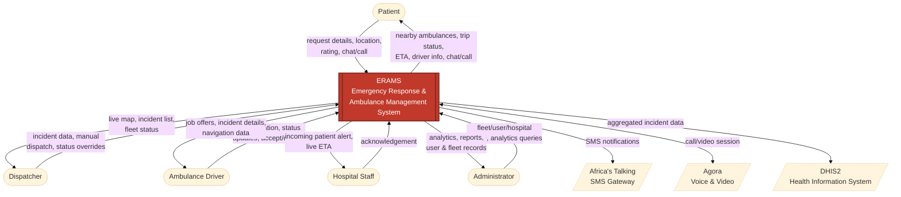
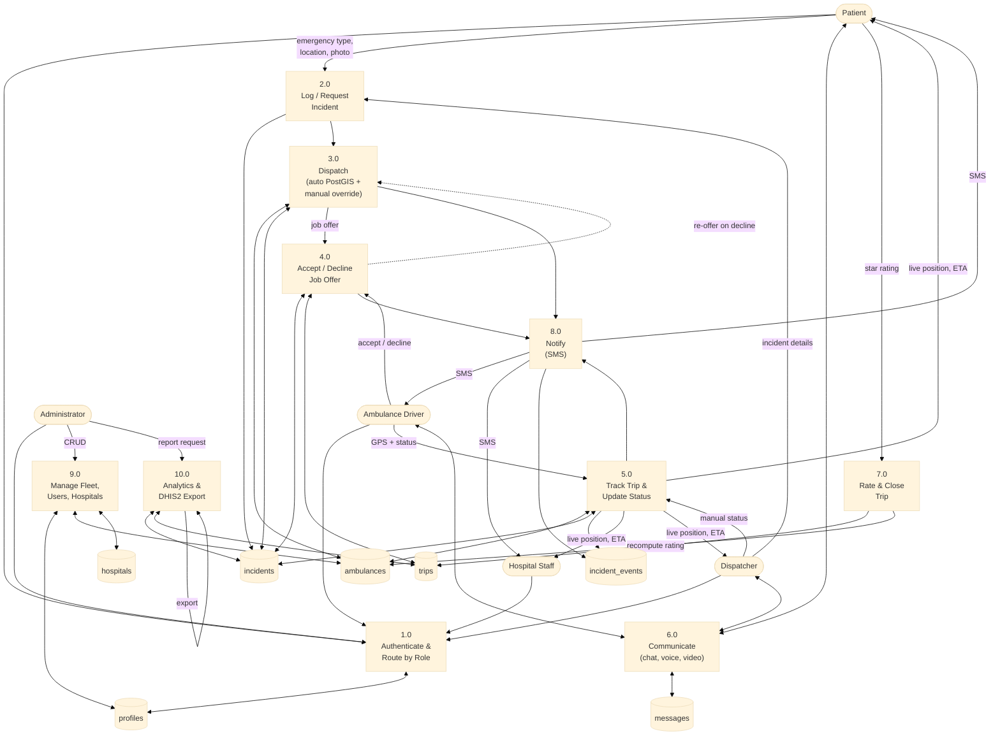
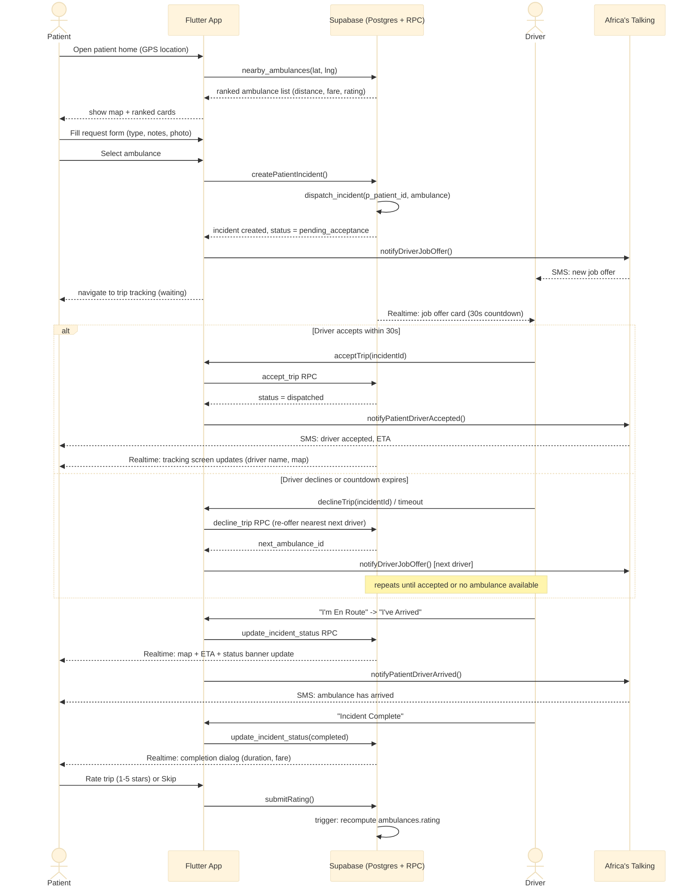

# ERAMS — System Diagrams

Diagrams are maintained as Mermaid source directly in this file (no separate image
export) so they render natively on GitHub, in VS Code (Markdown Preview Mermaid
Support extension), and in most Markdown viewers, and stay easy to update as the
system changes. For the final report / oral defense slides, open this file's
preview and export each rendered diagram as an image (e.g. right-click → Save
Image, or a screenshot of the rendered block).

Covers all 5 roles: Patient, Dispatcher, Ambulance Driver, Hospital Staff, Administrator.

---

## 1. DFD Level 0 — Context Diagram

ERAMS as a single process, showing every external entity and the three outbound
integrations (SMS, voice/video, DHIS2 export).



---

## 2. DFD Level 1 — System Decomposition

Breaks ERAMS into its 10 major processes and 7 data stores.



---

## 3. UML Use Case Diagram (all 5 roles)

Mermaid has no native use-case notation, so actors and use cases are modeled as a
flowchart: actors on the outside, use-case ovals inside the system boundary,
association lines showing which role performs which use case.

```mermaid
%%{init: {'theme': 'base', 'themeVariables': {'fontSize': '14px'}}}%%
flowchart LR
    Patient([Patient])
    Dispatcher([Dispatcher])
    Driver([Ambulance Driver])
    Hospital([Hospital Staff])
    Admin([Administrator])

    subgraph SYS["ERAMS System Boundary"]
        direction TB

        UC1((Register / Login))
        UC2((View Nearby Ambulances))
        UC3((Request Ambulance))
        UC4((Track Trip Live))
        UC5((Chat with Driver))
        UC6((Voice / Video Call))
        UC7((Rate Trip))

        UC8((Log Incident Manually))
        UC9((Auto-Dispatch Nearest))
        UC10((Manual Dispatch Override))
        UC11((View Live Fleet Map))
        UC12((View Incident History))

        UC13((Accept / Decline Job))
        UC14((Update GPS Location))
        UC15((Update Trip Status))
        UC16((Navigate to Scene))

        UC17((Acknowledge Incoming Patient))
        UC18((View Live ETA))

        UC19((Manage Fleet))
        UC20((Manage Users))
        UC21((Manage Hospitals))
        UC22((View Analytics))
        UC23((Export to DHIS2))
    end

    Patient --- UC1
    Patient --- UC2
    Patient --- UC3
    Patient --- UC4
    Patient --- UC5
    Patient --- UC6
    Patient --- UC7

    UC3 -. include .-> UC9

    Dispatcher --- UC1
    Dispatcher --- UC8
    Dispatcher --- UC9
    Dispatcher --- UC10
    Dispatcher --- UC11
    Dispatcher --- UC12
    Dispatcher --- UC5

    Driver --- UC1
    Driver --- UC13
    Driver --- UC14
    Driver --- UC15
    Driver --- UC16
    Driver --- UC5
    Driver --- UC6
    Driver --- UC12

    Hospital --- UC1
    Hospital --- UC17
    Hospital --- UC18
    Hospital --- UC12

    Admin --- UC1
    Admin --- UC19
    Admin --- UC20
    Admin --- UC21
    Admin --- UC22
    Admin --- UC23
```



---

## 4. Sequence Diagram — Patient Booking Flow

Covers Phases 10–13 and 15–16: request → nearest-driver offer → accept/decline
(with re-offer) → live tracking → arrival → completion → rating, with SMS
notifications at each milestone.



---

## 5. Sequence Diagram — Payment Flow (Planned, Phase 14)

**Not yet implemented.** Phase 14 (Flutterwave mobile money) is deferred by team
decision as of 3 Jul 2026 — every other patient-portal phase is complete, so this
is documented as the intended design for the final report, not shipped behavior.

```mermaid
%%{init: {'theme': 'base', 'themeVariables': {'fontSize': '14px'}}}%%
sequenceDiagram
    actor P as Patient
    participant App as Flutter App
    participant FW as Flutterwave API
    participant DB as Supabase (Postgres + Edge Function)
    actor D as Driver

    P->>App: Select ambulance, choose payment method
    alt MTN MoMo / Airtel Money
        App->>FW: Charge request (phone, amount)
        FW-->>P: USSD/PIN prompt on phone
        P->>FW: Approve payment
        FW->>DB: Webhook: payment success/failure
        DB->>DB: verify signature, update trips.payment_status
    else Card payment
        App->>FW: Inline checkout (WebView)
        FW-->>App: 3-D Secure / OTP challenge
        P->>App: Complete challenge
        FW->>DB: Webhook: payment success/failure
    else Cash
        App->>DB: Set payment_method = 'cash', payment_status = 'pending'
        Note over App,DB: No external call; proceeds immediately
    end

    DB-->>App: payment_status = paid (or cash pending)
    App->>DB: createPatientIncident() / dispatch_incident RPC
    DB-->>D: job offer (as in booking flow)

    opt Cash trips only
        D->>App: Confirm "cash received" at trip completion
        App->>DB: update trips.payment_status = 'cash_received'
    end
```

---

## 6. Sequence Diagram — Dispatcher-Initiated Flow

Covers Phases 2–7: the original telephone-in / dispatcher-logs-on-behalf-of-caller
flow, still fully supported alongside the patient-initiated flow above.

```mermaid
%%{init: {'theme': 'base', 'themeVariables': {'fontSize': '14px'}}}%%
sequenceDiagram
    actor Disp as Dispatcher
    participant App as Flutter App
    participant DB as Supabase (Postgres + RPC)
    actor D as Driver
    actor H as Hospital Staff
    participant SMS as Africa's Talking

    Disp->>App: New Incident form (pin location, type, notes, hospital)
    App->>DB: IncidentService.createIncident()
    DB-->>App: incident row created, status = logged
    DB-->>Disp: Realtime: card + map marker appear

    Disp->>App: Click "Dispatch Nearest"
    App->>DB: dispatch_incident RPC (no p_patient_id)
    DB->>DB: ST_Distance nearest available ambulance
    alt Ambulance found
        DB-->>App: assigned_ambulance_id set, status = dispatched
        App->>SMS: notifyHospitalIncomingPatient()
        SMS-->>H: SMS: incoming patient + ETA
        DB-->>D: Realtime: incident alert (no accept/decline; dispatcher-assigned)
    else No ambulance available
        DB-->>App: error: no_ambulance_available
        App-->>Disp: red banner + "Manual" fallback button
        Disp->>App: Manual dispatch (pick ambulance from ranked list)
        App->>DB: dispatch_incident RPC (p_ambulance_id override)
        DB-->>App: assigned_ambulance_id set, status = dispatched
    end

    D->>App: "I'm En Route"
    App->>DB: update_incident_status RPC
    DB-->>Disp: Realtime: card + marker update (blue)
    DB-->>H: Realtime: ETA updates as ambulance GPS moves

    H->>App: "Acknowledge - Ready to Receive"
    App->>DB: acknowledgeIncident() -> incident_events row

    D->>App: "I've Arrived" -> "Incident Complete"
    App->>DB: update_incident_status RPC (arrived, then completed)
    DB-->>Disp: incident removed from active list, appears in History
    DB-->>Disp: Admin analytics: response time recorded (created_at -> arrived_at)
```
